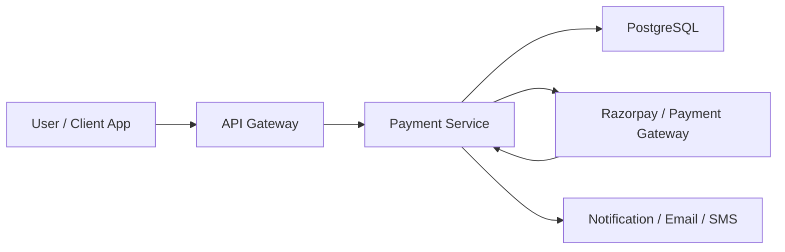

# 01. Payment Link Orchestration

## What this feature does
This feature creates a payment link for a customer, tracks the link state, and connects the link to a business transaction. It is useful when the business wants the user to complete payment later through a secure hosted checkout page instead of taking card details inside the product.

## Why this is a strong interview topic
- It combines transaction creation, external gateway integration, expiry handling, and state management.
- It naturally introduces idempotency, retries, asynchronous confirmation, and auditability.

## Real Aurum signals behind this topic
- Service: `aurum-payment-service`
- Main entities: `Transaction`, `PaymentLink`, `PaymentAttempt`
- Useful columns: `idempotency_key`, `gateway_link_id`, `payment_url`, `short_url`, `expires_at`, `status`, `last_event_timestamp`

## Core requirements
- Create a single business transaction for a payment intent.
- Generate one or more payment links for that transaction.
- Prevent duplicate links on client retries.
- Mark links as expired, paid, or invalid.
- Allow the payment gateway to remain the source of truth for actual payment completion.

## High-level architecture

## Main request flow
1. Client sends a create-payment request with customer, amount, and an `idempotencyKey`.
2. Payment service creates a `Transaction` row in `INITIATED` state.
3. Service calls the payment gateway to create a hosted payment link.
4. Service stores gateway response in `PaymentLink`.
5. Client receives `paymentUrl` or `shortUrl`.
6. Later, webhook or polling confirms the outcome.

## Database schema
- `transactions`
  - `transaction_id`, `idempotency_key`, `customer_id`, `amount`, `currency`
  - `gateway_type`, `checkout_mode`, `status`, `failure_reason`
  - `created_at`, `updated_at`, `completed_at`, `last_event_timestamp`
- `payment_links`
  - `link_id`, `transaction_id`, `link_number`
  - `gateway_link_id`, `payment_url`, `short_url`
  - `expires_at`, `status`, `paid_at`, `expired_at`
- `payment_attempts`
  - `attempt_id`, `transaction_id`, `payment_link_id`
  - `gateway_payment_id`, `payment_method`, `status`
  - `amount`, `utr`, `captured_at`, `failed_at`

## Tech stack used
- Spring Boot 3
- Java 21
- PostgreSQL
- Flyway migrations
- OpenFeign + OkHttp for gateway calls
- Micrometer + Prometheus

## Deep system design concepts
- `Idempotency`: same client retry must not create multiple business transactions.
- `External integration`: gateway response can be delayed or partially fail.
- `State machine`: `PENDING`, `PAID`, `EXPIRED`, `FAILED`.
- `Time-based workflows`: expired links should stop accepting business actions.
- `Observability`: logs and metrics around gateway latency and conversion rate matter.

## Important tradeoffs
- If you trust synchronous gateway response too much, you may mark payments incorrectly.
- If you wait only for webhooks, user experience becomes slower.
- Best design: synchronous link creation, asynchronous payment confirmation.

## Failure handling
- Gateway timeout after transaction creation: retry safely using `idempotency_key`.
- Duplicate client request: return existing link if still valid.
- Link expired before payment: create new link with incremented `link_number`.

## How to explain in interview
Say: "I would separate the business transaction from the payment link. A transaction is the durable payment intent, while the link is just one checkout attempt. That gives us retries, expiry control, and clean auditing."
