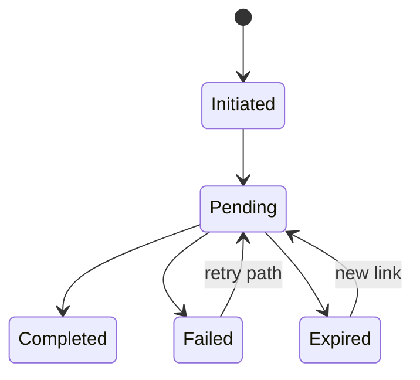

# 02. Transaction Lifecycle and Idempotency

## What this feature does
This feature manages the full payment transaction lifecycle from initiation to success or failure. It ensures that even if the client retries the same request many times, the system creates only one logical transaction.

## Why interviewers like this topic
- It shows understanding of correctness under retries.
- It is a clean place to discuss concurrency, locking, duplicate suppression, and event ordering.

## Real Aurum signals behind this topic
- Service: `aurum-payment-service`
- Main entity: `Transaction`
- Important columns: `transaction_id`, `idempotency_key`, `status`, `gateway_order_id`, `metadata`, `failure_reason`, `last_event_timestamp`

## Functional needs
- Create a payment transaction exactly once for a client intent.
- Store taxes, amount breakup, gateway details, and completion timestamps.
- Support status transitions like `INITIATED -> PENDING -> COMPLETED` or `FAILED`.
- Ignore stale updates coming from delayed webhooks or retried calls.

## Architecture

## Main flow
1. Client sends a request with `idempotencyKey`.
2. Service checks whether the key already exists.
3. If present, return the previous transaction response.
4. If not present, create transaction row and continue payment processing.
5. Later status updates arrive from gateway or internal handlers.
6. Service updates the row only if the event is newer than the existing state.

## Database schema
- `transactions`
  - identity: `transaction_id`, `idempotency_key`
  - payment context: `gateway_type`, `checkout_mode`, `gateway_order_id`, `gateway_payout_id`
  - money fields: `amount`, `base_amount`, `cgst_amount`, `sgst_amount`, `igst_amount`, `total_tax`
  - status fields: `status`, `failure_reason`
  - control fields: `metadata`, `last_event_timestamp`, `created_at`, `updated_at`

## Key design decisions
- Put a unique constraint on `idempotency_key`.
- Use optimistic locking or version checks on updates.
- Store `last_event_timestamp` so old events do not overwrite new truth.
- Keep transaction state independent of UI session state.

## Scale discussion
- Read-heavy workloads can use a cache for transaction status lookups.
- Write path must stay strongly consistent because money is involved.
- Partitioning can be done by date or customer if transaction volume grows a lot.

## Failure scenarios
- Two identical requests arrive together: DB uniqueness protects correctness.
- Gateway sends completion twice: second event is ignored.
- Internal worker crashes after DB write: retry handler must be idempotent.

## How to explain in interview
Say: "For payments, duplicate creation is more dangerous than extra latency. So I would anchor correctness on a durable transaction table with a unique idempotency key and timestamp-aware status updates."
