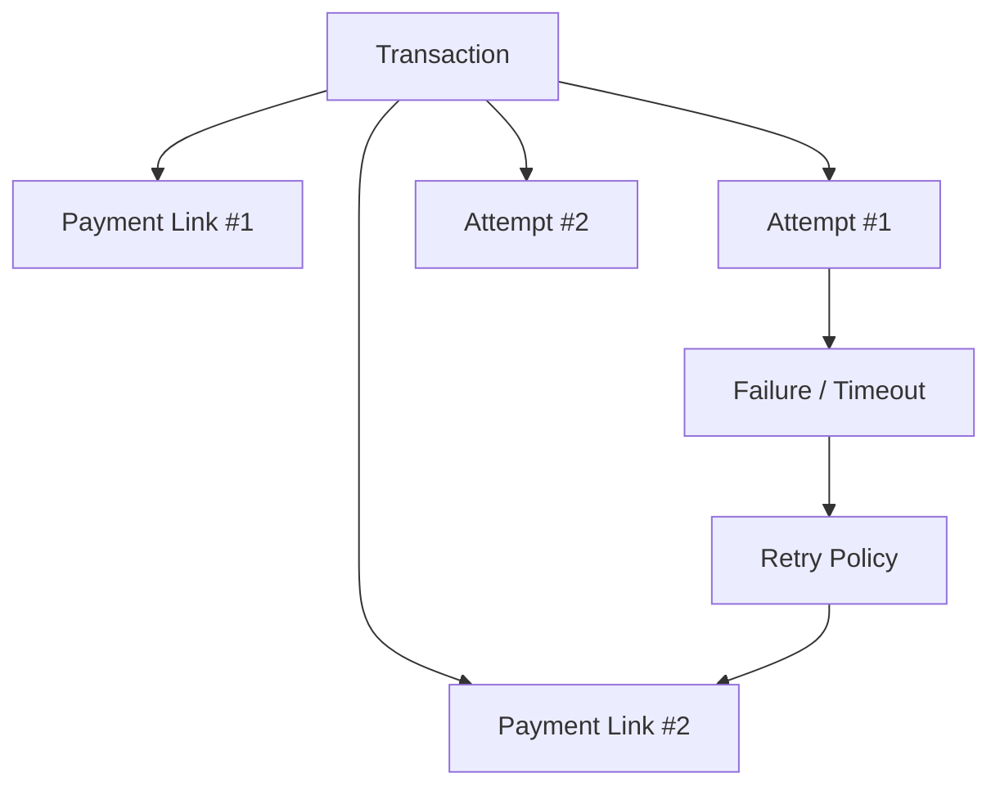

# 03. Payment Retry Orchestration

## What this feature does
If a payment fails or a link expires, this feature helps the system safely create another attempt without losing the original business context.

## Why it matters
- Real users retry often.
- Payment gateways can fail temporarily.
- Businesses need high conversion but cannot afford double charging.

## Real Aurum signals behind this topic
- Controllers: `RetryPaymentController`, `PaymentController`
- Entities: `Transaction`, `PaymentLink`, `PaymentAttempt`
- Important fields: `link_number`, `status`, `failure_code`, `expires_at`, `last_event_timestamp`

## System design idea
One business intent can have many operational attempts. So retries should create new link records or attempt records, not new business meaning.

## Retry architecture

## Main flow
1. Existing transaction is found by `transaction_id` or `idempotency_key`.
2. Service checks whether retry is allowed.
3. Old link is marked expired or inactive if needed.
4. New link is created with `link_number + 1`.
5. New payment attempt is tracked separately.
6. Final completion updates the original transaction.

## Schema view
- `transactions`
  - keeps the stable business intent
- `payment_links`
  - stores per-link retry information through `link_number`
- `payment_attempts`
  - stores each operational payment try with method, gateway id, and failure data

## Important concepts
- `Retry budget`: avoid infinite retries.
- `Attempt isolation`: failed attempts must not corrupt the master transaction.
- `User experience`: quickly return the next valid link.
- `Fraud control`: too many retries can indicate abuse.

## Interview tradeoffs
- Automatic retries improve conversion but may confuse users if done without visibility.
- Manual retries give cleaner user control but need better UI support.
- A hybrid model is often best: auto-retry for transient gateway errors, manual retry for business failures.

## How to explain in interview
Say: "I would model retries as new attempts attached to the same transaction. That preserves correctness, gives clean auditing, and prevents duplicate charging."
