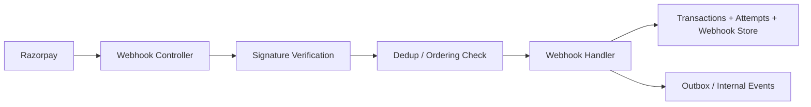

# 04. Razorpay Webhook Processing

## What this feature does
The payment gateway sends asynchronous events such as payment success, failure, and settlement updates. This feature validates those events and updates internal state safely.

## Why this is an excellent system design topic
- It covers asynchronous architecture.
- It naturally introduces signature validation, deduplication, and eventual consistency.

## Real Aurum signals behind this topic
- Controller: `RazorpayWebhookController`
- Package structure: `payment.webhook.controller`, `handler`, `processor`, `service`
- Migrations mention webhook protection columns and outbox-style support

## Requirements
- Accept only authentic gateway events.
- Process each event exactly once from a business point of view.
- Ignore duplicates and out-of-order delivery.
- Update transaction and payment-attempt state.

## Architecture

## Processing flow
1. Receive webhook payload and signature.
2. Verify signature using shared secret.
3. Check whether the event id has already been processed.
4. Compare event timestamp with `last_event_timestamp`.
5. Apply business update only if event is valid and newer.
6. Optionally publish internal event for invoice, entitlement, notification, or analytics.

## Data model
- `transactions`
  - final payment truth and event ordering metadata
- `payment_attempts`
  - gateway payment identifiers and method-specific data
- `webhook_events` or equivalent store
  - event id, signature check result, processing status, raw payload, received time

## Key design concepts
- `Authentication`: verify gateway signature.
- `Idempotency`: duplicate webhook delivery is normal.
- `Ordering`: later events must win over stale events.
- `Replay protection`: store processed event ids and timestamps.
- `Outbox pattern`: useful when one webhook update must trigger more downstream actions.

## Failure handling
- Signature invalid: reject with 4xx and log security alert.
- DB temporarily down: persist payload for retry if possible.
- Downstream consumer fails: keep webhook processing small and push side effects asynchronously.

## How to explain in interview
Say: "Webhook processing should be small, authenticated, idempotent, and timestamp-aware. The webhook endpoint should update durable state first, then fan out side effects asynchronously."
