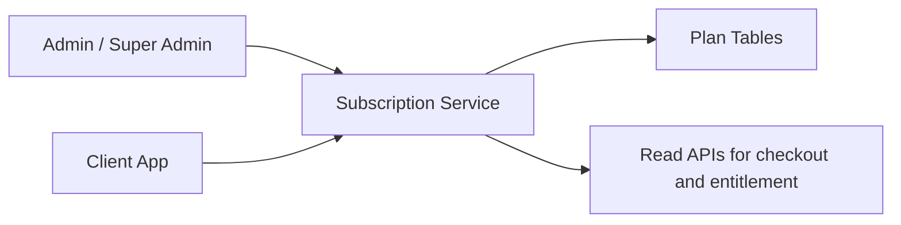

# 05. Subscription Plan Catalog

## What this feature does
This feature manages plans like free, premium, store, or tier-based offerings. Each plan has price, validity, tax settings, display order, and related features.

## Real Aurum signals behind this topic
- Controllers: `PlanController`, `SubscriptionSuperAdminController`
- Entities: `SubscriptionPlan`, `PlanFeature`, `Feature`
- Migrations: plan creation, tier level, store plans, GST behavior, branch feature addition

## Why it is interview-worthy
- It models a configurable product catalog, not hard-coded business logic.
- It opens discussion on versioning, backward compatibility, and plan rollout.

## Main requirements
- Create and update plans without code changes.
- Attach multiple capabilities to one plan.
- Support different subscriber types such as user and store.
- Allow featured plans and default plans.

## Architecture

## Core schema
- `subscription_plans`
  - `plan_id`, `plan_code`, `entity_type`, `name`, `description`
  - `price`, `currency`, `validity_days`, `grace_period_days`
  - `tier_level`, `is_featured`, `is_default`
  - `is_gst_inclusive`, `gst_rate`, `hsn_sac_code`
- `features`
  - `feature_id`, `feature_code`, `name`, `display_name`, `unit_name`
- `plan_features`
  - `plan_feature_id`, `plan_id`, `feature_id`
  - `quota_type`, `quota_value`, `display_value`

## Design concepts
- `Config-driven business logic`
- `Plan-feature join table`
- `Backward compatibility`
- `Tiering and default selection`
- `Tax-aware pricing`

## Scaling and product concerns
- Plan catalog is mostly read-heavy, so caching is useful.
- Updates are rare but high impact, so admin writes should be audited.
- Plan changes should not silently break old subscriptions.

## Good interview extension
Discuss plan versioning:
- old subscribers may remain on plan version 1
- new buyers may get plan version 2
- entitlement calculation should depend on the subscription snapshot, not only the latest plan row

## How to explain in interview
Say: "I would not hard-code premium logic in application code. I would maintain a plan catalog and a plan-feature mapping table so product teams can launch or update plans safely."
