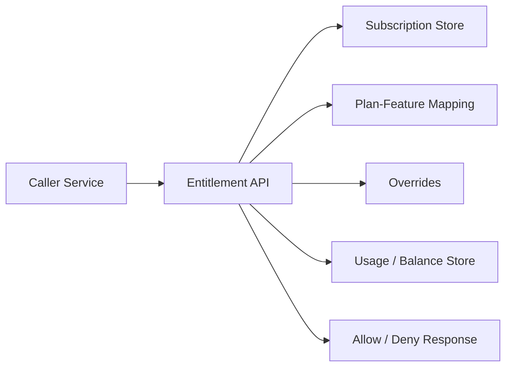

# 06. Entitlement and Feature Gating

## What this feature does
After a user or store buys a plan, the system decides what they are allowed to do. This is the entitlement layer. It answers questions like: "Can this tenant create one more branch?" or "Does this user still have bidding credits?"

## Real Aurum signals behind this topic
- Controllers: `EntitlementInternalController`, `FeatureInternalController`
- Migrations: entitlement schema, balance updates, feature cost, store branch feature
- Entities: `Feature`, `PlanFeature`, `UserSubscription`

## Why this is a top interview topic
- It connects payments to authorization.
- It mixes product modeling, quota enforcement, and low-latency reads.

## Architecture

## Main flow
1. Caller sends `subscriberId`, `subscriberType`, `featureCode`.
2. Service loads active subscription.
3. Service reads mapped quota for that feature.
4. Service checks current usage or remaining balance.
5. Service checks override records.
6. Service returns allow/deny plus reason.

## Schema
- `user_subscriptions`
  - `subscription_id`, `subscriber_id`, `subscriber_type`, `plan_id`, `status`
  - `started_at`, `expires_at`, `grace_period_ends_at`
- `features`
  - `feature_code`, `credit_cost_per_operation`
- `plan_features`
  - `quota_type`, `quota_value`
- `entitlement_balance` or equivalent
  - remaining quota, consumed quota, reset date

## Deep concepts
- `Read path latency`: entitlement checks often sit on hot API paths.
- `Consistency`: usage must not overshoot quota under concurrency.
- `Quota models`: unlimited, fixed count, metered credits, time-based access.
- `Grace period`: service may still work briefly after expiry.

## Common design choices
- Cache active plan and feature map.
- Keep usage counters in a fast store if the traffic is large.
- Use atomic updates for quota consumption.

## Failure scenarios
- Payment succeeded but subscription activation is delayed.
- Two requests consume the last quota at the same time.
- Override says enabled while base plan says disabled.

## How to explain in interview
Say: "Entitlement is the bridge between monetization and product access. I would keep it as a dedicated internal service or module so every feature can ask for a fast and consistent allow-or-deny decision."
