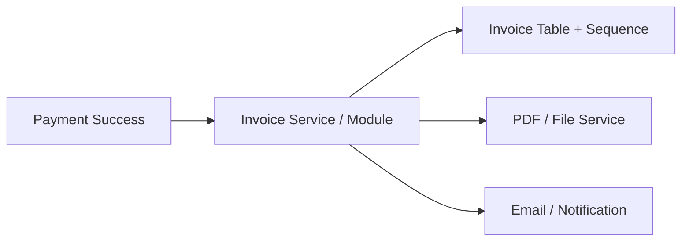

# 07. Invoice Generation and Taxation

## What this feature does
When a payment or subscription purchase happens, the system creates a tax-compliant invoice with amount breakup, GST details, customer details, seller details, numbering, and attachment references.

## Real Aurum signals behind this topic
- Controllers: `InvoiceInternalController`
- Entity: `Invoice`
- Migrations: invoice table, sequence id, invoice number length, GST fields

## Why interviewers ask this style of feature
- It tests whether you think beyond the payment success screen.
- It introduces numbering, compliance, immutable records, and attachment generation.

## Architecture

## Main flow
1. A successful paid transaction becomes the trigger.
2. Service loads customer, plan, and tax context.
3. Service calculates base amount and tax components.
4. Service reserves the next invoice sequence number.
5. Service persists immutable invoice data.
6. PDF is generated and stored, then the attachment id is saved.

## Database schema
- `invoices`
  - `id`, `invoice_number`, `sequence_id`
  - `user_id`, `reference_type`, `reference_id`, `transaction_id`
  - `plan_code`, `plan_name`, `description`
  - `base_amount`, `cgst_amount`, `sgst_amount`, `igst_amount`, `total_tax`, `total_amount`
  - `gst_rate`, `hsn_sac_code`, `tax_type`
  - `customer_name`, `customer_email`, `customer_phone`, `customer_gstin`, `customer_state`
  - `seller_name`, `seller_gstin`, `seller_pan`, `seller_state`
  - `attachment_id`, `status`, `invoice_date`

## Key concepts
- `Immutable accounting record`
- `Monotonic invoice numbering`
- `Jurisdiction-specific taxation`
- `Attachment generation pipeline`
- `Eventual consistency acceptable for PDF, not for invoice row`

## Design tradeoffs
- Synchronous PDF generation gives immediate download but increases latency.
- Async PDF generation is better for scale but needs polling or notification.

## How to explain in interview
Say: "I would separate invoice persistence from invoice rendering. The invoice row is the compliance truth, while the PDF is only a representation of that truth."
