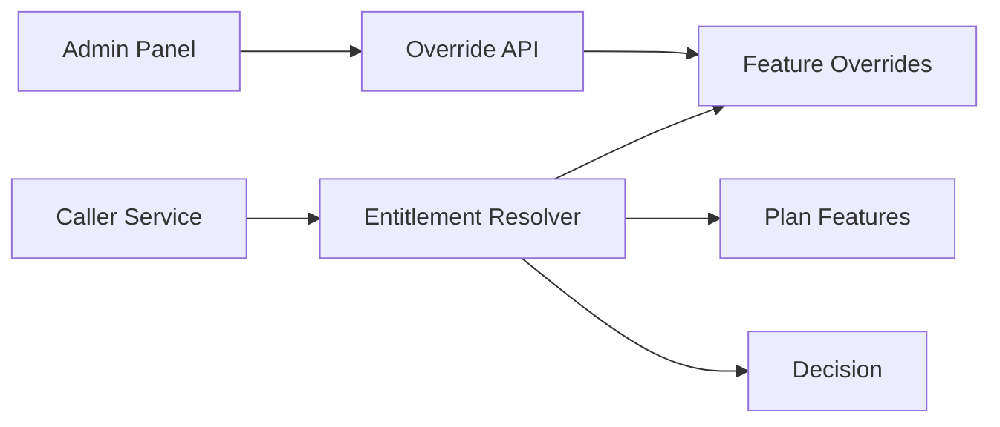

# 08. Feature Overrides for Tenants

## What this feature does
Sometimes the business wants to enable or disable a feature for one tenant or one user without changing the main plan. This feature provides that override layer.

## Real Aurum signals behind this topic
- Entity: `FeatureOverride`
- Controllers: `FeatureSuperAdminController`, internal feature APIs
- Migrations: create and migrate feature overrides

## Why this is useful in interviews
- It shows you can design flexible B2B SaaS controls.
- It introduces precedence rules and time-bound exceptions.

## Schema
- `feature_overrides`
  - `id`, `entity_id`, `entity_type`, `feature_code`
  - `is_enabled`, `reason`, `valid_until`
  - `created_by`, `updated_by`

## Architecture

## Resolution order
1. Load active subscription feature state.
2. Load matching override by `entity_id`, `entity_type`, `feature_code`.
3. If valid and not expired, apply override.
4. Return final allow/deny decision with reason.

## Important concepts
- `Precedence rules`
- `Temporary feature flags`
- `Auditability`
- `Manual support tooling`
- `Blast radius control`

## Example use cases
- Enable beta feature for one store.
- Disable a feature for a fraud-risk tenant.
- Give premium capability temporarily during support escalation.

## Interview tradeoff
Too many overrides can become hidden business logic. Good systems keep them visible, time-bound, and auditable.

## How to explain in interview
Say: "Overrides are useful, but they should sit on top of the normal plan model with explicit precedence and expiry so the system does not become impossible to reason about."
