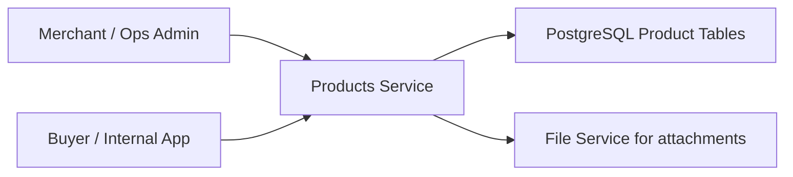

# 09. Product Catalog Management

## What this feature does
This feature stores detailed gold or jewelry product data such as SKU, category, purity, weight, dimensions, quantity, pricing attributes, demographics, and attachments.

## Real Aurum signals behind this topic
- Controller: `AurumProductsController`
- Entity set: `ProductEntity`, `ProductPricingAttributeEntity`, `ProductDemographicsEntity`, `ProductComponentEntity`
- Migrations: products tables, schema updates, hall mark, pricing attributes, unique numbering

## Why it is a strong system design topic
- Product catalogs are foundational in many product companies.
- It combines normalization, searchability, media links, and version-safe updates.

## High-level architecture

## Schema
- `products`
  - `product_id`, `product_number`, `product_name`, `sku`
  - `metal_id`, `metal_type_id`, `category_id`, `sub_category_id`, `purity_type_id`
  - `gross_weight`, `alloy_weight`, `net_weight`, `purity_percentage`
  - `quantity`, `purchase_year`, `original_purchase_price`
  - `reference_type`, `reference_id`
  - `product_unique_id`, `product_version_id`, `is_active_version`
  - `hall_mark_id`, `hu_id`
- `product_pricing_attributes`
  - `pricing_id`, `product_id`, `va_type`, `va_value`, `making_type`, `making_value`
- `product_demographics`
  - `product_id`, `demographics_id`
- `product_components`
  - `component_type_id`, `weight`, `quantity`, `unit_value`, `total_value`

## Core design ideas
- Use normalized tables for reusable product attributes.
- Keep business identifiers like `product_number` separate from primary keys.
- Store file references, not binary files, in the product database.
- Prepare for filtering by category, purity, price, and weight.

## Interview expansion points
- Full-text search or Elastic integration
- Catalog cache
- Read replicas
- Bulk import pipelines
- Search indexing lag versus transactional correctness

## How to explain in interview
Say: "I would keep the product master row lean and push repeating or multi-valued attributes into child tables. That gives better normalization, cleaner updates, and more flexible query design."
