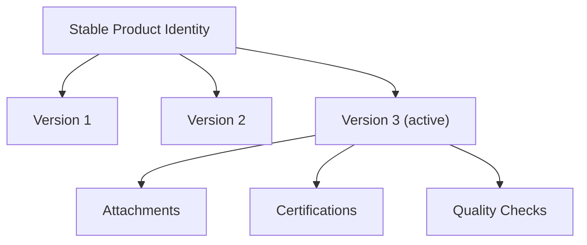

# 10. Product Versioning and Attachments

## What this feature does
This feature preserves product history by introducing stable product identity and separate version identity. It also links media and certification assets to products.

## Real Aurum signals behind this topic
- Migrations mention `product_versioning`
- Important columns in `ProductEntity`: `product_unique_id`, `product_version_id`, `is_active_version`
- Related entities: `ProductAttachmentEntity`, `ProductCertificationEntity`, `ProductQualityCheckEntity`

## Why it matters
- Product data changes over time.
- Auditors and downstream systems may need the exact old version.
- Attachments often change independently of core metadata.

## Architecture

## Schema
- `products`
  - `product_unique_id`: stable identity across versions
  - `product_version_id`: version-specific identity
  - `is_active_version`: marks current version
- `product_attachments`
  - `prod_attachment_id`, `product_id`, `attachment_type`, `attachment_id`
  - `is_primary`, `display_order`, `uploaded_by_user_id`

## Design concepts
- `Auditability`: old version should remain queryable.
- `Safe edits`: updates can create a new version instead of mutating history.
- `Media decoupling`: file service stores the heavy binary objects.
- `Reference stability`: external systems can rely on `product_unique_id`.

## Tradeoffs
- Versioning increases storage.
- Query logic becomes slightly more complex because clients usually want only the active version.
- But it greatly improves traceability and rollback safety.

## How to explain in interview
Say: "I would separate product identity from product version. That lets me update listings without losing historical truth and still keep one active version for the main read path."
