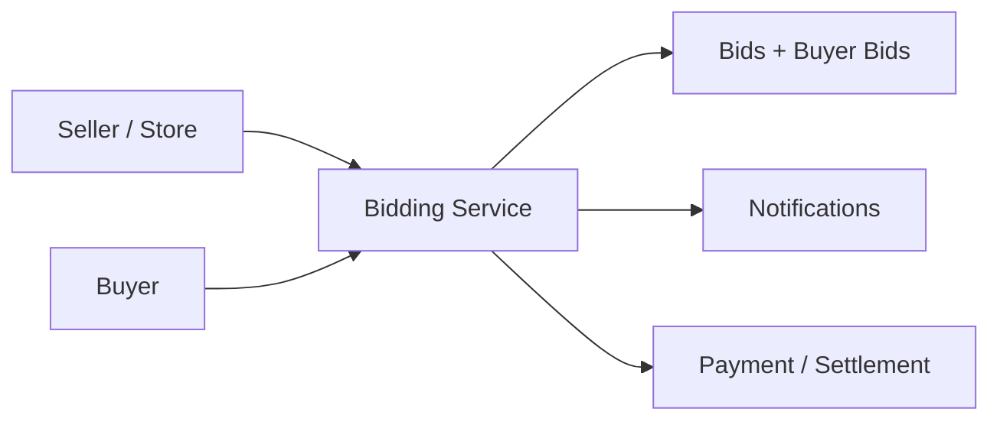

# 11. Bidding Marketplace

## What this feature does
This feature allows a product to go through a controlled bidding flow where buyers place bids and the system tracks lifecycle states from submission to completion.

## Real Aurum signals behind this topic
- Controllers: `AurumBiddingController`, `AurumBiddingServiceController`
- Main entities: `BiddingEntity`, `BuyerBidEntity`
- Fields show states, timing windows, price expectations, auto-approval, service charges, and settlement data

## Why it is a premium interview topic
- It involves marketplace design, state machines, time windows, and multi-party workflows.

## Architecture

## Main flow
1. Seller submits product for bidding.
2. System creates a bid listing with expected value and bidding window.
3. Buyers submit competitive bids.
4. Bids are reviewed automatically or manually.
5. Winning bid moves toward visit, acceptance, and payment.

## Database schema
- `biddings`
  - `bid_id`, `product_id`, `bid_number`, `store_id`, `branch_id`
  - price expectations: seller expected VA and making values
  - floor and ceiling values
  - charges: platform, certification, repair, service
  - timing: `bidding_start_ts`, `bidding_end_ts`, `extended_end_ts`
  - control: `auto_approve`, `can_receive_bids`, `auto_settlement`
  - state timestamps: submitted, approved, live, completed, cancelled
- `buyer_bids`
  - `buyer_bid_id`, `bid_id`, `buyer_user_id`
  - bid values, status, review comments
  - visit tracking and final payment markers

## Concepts to discuss
- `Auction window management`
- `Concurrency on last-minute bids`
- `Auto-extension to avoid sniping`
- `Approval workflows`
- `Multi-party trust and transparency`

## Scaling ideas
- Read-heavy live-bid screens may need cache or websocket fanout.
- Write path must remain serialized enough to preserve winning logic.

## How to explain in interview
Say: "This is basically a marketplace workflow with a time-bound auction state machine. I would keep bid listing state separate from individual buyer offers and make state transitions explicit."
