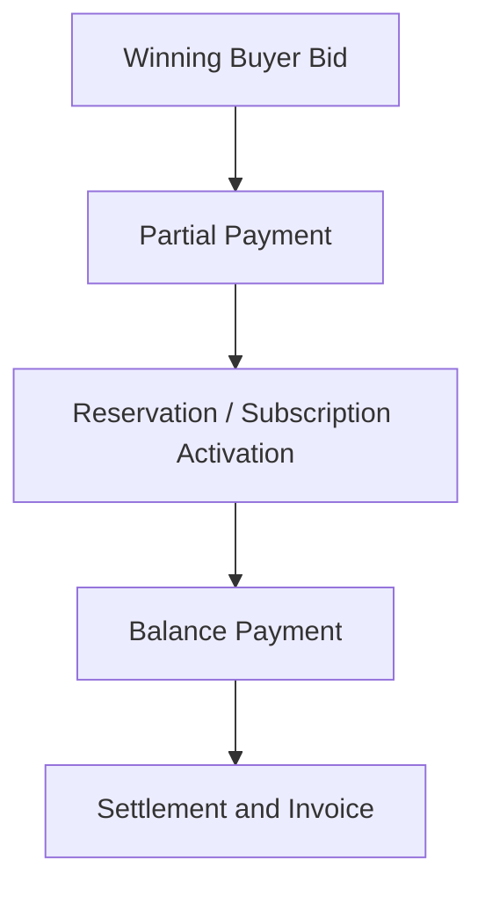

# 12. Partial Payment and Bid Settlement

## What this feature does
This feature allows the winning bid journey to use partial payment first and balance payment later. It also supports subscription-linked payment plans and downstream settlement.

## Real Aurum signals behind this topic
- Entities: `BidPartialPaymentEntity`, `PaymentTransactionEntity`
- Important fields: `partial_payment_percentage`, `balance_amount`, `partial_payment_txn_id`, `balance_payment_txn_id`, `invoice_number`

## Why it is interview-worthy
- It mixes money flow, lifecycle management, and deferred settlement.
- It is a realistic way to discuss consistency in a staged payment process.

## Flow

## Core schema
- `bid_partial_payments`
  - `partial_payment_id`, `bid_id`, `plan_id`
  - `partial_payment_percentage`, `partial_payment_amount`, `balance_amount`
  - `subscription_start_date`, `subscription_end_date`
  - `partial_payment_txn_id`, `balance_payment_txn_id`
  - settlement flags and auto-renewal flags
- `payment_transactions`
  - `transaction_id`, `product_id`, `bid_id`, `payment_type_id`
  - `amount`, `payment_status_id`, `payment_method_id`
  - `payment_reference_id`, `payment_gateway_txn_id`
  - `invoice_generated`, `invoice_number`, `invoice_attachment_id`

## Main design concepts
- `Split payment lifecycle`
- `Reservation versus full ownership`
- `Settlement dependency chain`
- `Invoice generation at the right stage`

## Risks
- Partial payment succeeds but balance payment fails.
- Seller inventory should not be sold twice during the reserved period.
- Finance and product systems must agree on final completion.

## How to explain in interview
Say: "I would model partial and balance payments as separate financial events but tie them to one commercial journey. That keeps accounting clean and allows the product flow to pause safely between stages."
