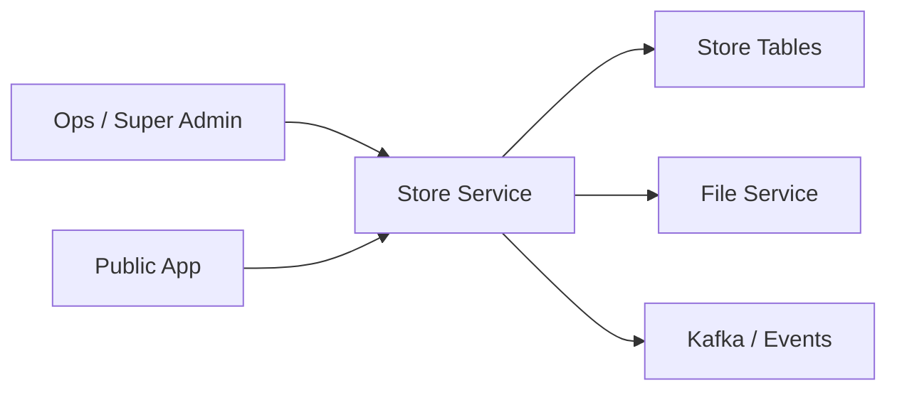

# 13. Store Onboarding and Lifecycle

## What this feature does
This feature creates and manages store tenants with category, domain, status, branding, and business metadata.

## Real Aurum signals behind this topic
- Controllers: `StoreController`, `StorePublicController`, `StoreInternalController`, `SuperAdminController`
- Entity: `StoreEntity`
- Fields: `tenant_id`, `status`, `domain_prefix`, `business_type_id`, `referral_code`

## Why this is an interview classic
- It is multi-tenant SaaS design.
- It lets you discuss onboarding workflow, tenant identity, and tenant isolation.

## Architecture

## Schema
- `stores`
  - `id`, `store_name`, `tenant_id`, `status`, `category_id`
  - `logo_attachment_id`, `domain_prefix`
  - `business_type_id`, `referral_code`
  - `created_by`, `updated_by`, `created_at`, `updated_at`

## Design concepts
- `Tenant identity`
- `Public versus internal APIs`
- `Branding and domain mapping`
- `Lifecycle states`: pending, active, suspended, archived
- `Event-driven integration`: store-created events can activate downstream setup

## Interview tradeoffs
- Separate database per tenant gives stronger isolation but higher operational cost.
- Shared database with tenant keys scales operationally but needs stronger access control.

## How to explain in interview
Say: "I would treat each store as a tenant with its own lifecycle and metadata. Tenant-aware APIs and clean status transitions are more important than only the CRUD layer."
