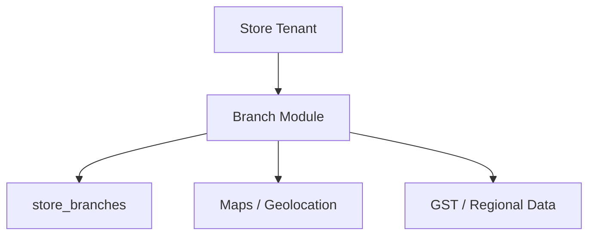

# 14. Store Branch Management

## What this feature does
This feature manages multiple physical branches under one store, including address, GST number, geolocation, contact details, and primary-branch logic.

## Real Aurum signals behind this topic
- Controllers: `AurumStoreBranchesController`, `BranchProductsController`
- Entity: `StoreBranchEntity`
- Migrations: branch column additions, branch products, GST support, store branches feature

## Why it matters in interviews
- It is a strong example of hierarchical data modeling.
- It supports geographic search, operations, and branch-level permissions.

## Architecture

## Schema
- `store_branches`
  - `id`, `store_id`, `branch_unique_code`, `branch_name`
  - `country_id`, `state_id`, `city_id`, `pincode`, `full_address`
  - `google_maps_location`, `latitude`, `longitude`
  - `phone_number`, `whatsapp_number`, `gst_number`
  - `is_primary_branch`, `status`, `is_active`

## System design concepts
- `Parent-child consistency`
- `Geo-indexing and nearest-branch lookup`
- `Branch-specific taxation and contact details`
- `Soft deletes versus archival`

## Interview extension
If traffic is large:
- keep branch lookup cache by store
- precompute location-based branch groups
- maintain branch-level inventory and branch-level offers separately

## How to explain in interview
Say: "A store is the tenant-level entity, but many user experiences are branch-centric. So I would model branches as first-class operational units with their own address, GST, and status."
