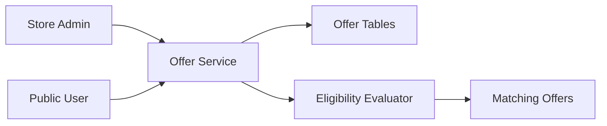

# 15. Store Offer Engine

## What this feature does
This feature allows stores to create promotional campaigns such as making-charge discounts, exchange offers, and buy-X-get-Y-free offers with category and branch targeting.

## Real Aurum signals behind this topic
- Controllers: `OffersStoreController`, `OffersPublicStoreController`, `AurumSuperAdminOffersController`
- Entity: `StoreOfferEntity`
- Child models: `MainMakingVaEntity`, `MainExchangeEntity`, `BuyXGetYFreeEntity`

## Why this is strong for interviews
- It is a rules-engine style system.
- It mixes campaign configuration, targeting, and read-time eligibility checks.

## Architecture

## Schema
- `store_offers`
  - `id`, `offer_name`, `offer_type`
  - `metal_id`, `category_id`, `store_id`
  - `start_date`, `end_date`, `is_active`
  - `is_all_categories`, `is_all_sub_categories`, `is_all_branches`
  - `branch_ids`
  - nested details for making, exchange, or bundle offers

## Key concepts
- `Targeting`: branch-level, category-level, metal-level
- `Validity windows`
- `Rule evaluation order`
- `Conflict resolution when multiple offers match`

## Tradeoffs
- Simple DB filtering is easy but limited.
- A dedicated rules engine is powerful but more complex.
- Most systems start with DB-backed rules and evolve later.

## How to explain in interview
Say: "I would separate campaign definition from eligibility evaluation. That way product teams can create offers flexibly while the runtime path stays deterministic and testable."
