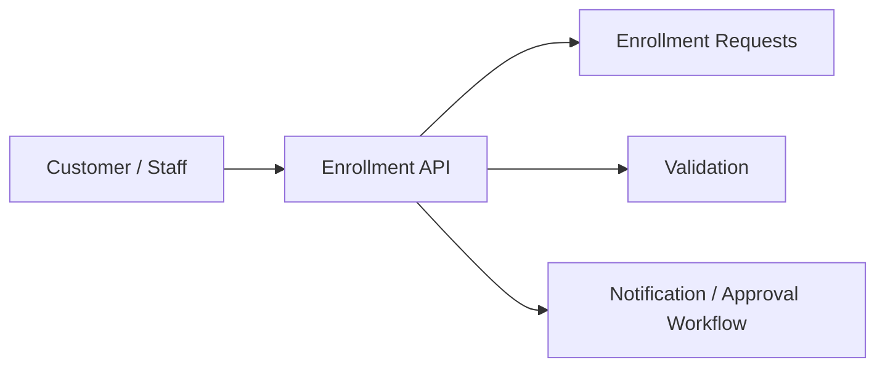

# 16. Customer Enrollment Flow

## What this feature does
This feature captures customer enrollment requests for a store, including identity details, referral data, and approval status.

## Real Aurum signals behind this topic
- Controllers: `CustomerEnrollmentController`, `AurumStoreCustomerController`
- Entity: `CustomerEnrollmentRequestEntity`
- Migrations: customer enrollment request table and related page/permissions

## Why it is a useful interview topic
- It shows workflow design, status transitions, and referral attribution.

## Architecture

## Schema
- `customer_enrollment_requests`
  - `id`, `store_id`
  - `first_name`, `last_name`, `mobile_number`, `email`, `gender`
  - `country_id`, `state_id`, `city_id`
  - `staff_referral_code`, `referred_staff_id`
  - `status`, `rejection_reason`

## Concepts to discuss
- `Workflow states`: pending, approved, rejected
- `Data validation`: duplicate mobile or email checks
- `Referral tracking`
- `Human review and audit trail`

## Interview extension
You can expand this to a KYC-like system by adding OTP verification, document upload, and fraud checks.

## How to explain in interview
Say: "I would store enrollment as a request first, not directly as a final customer row. That gives a clean place for validation, manual review, and referral attribution."
