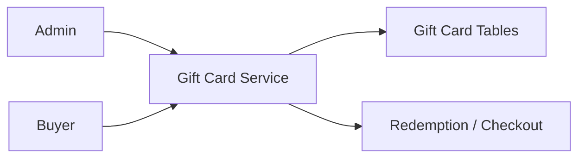

# 17. Gift Card Platform

## What this feature does
This feature allows the business to define gift cards with value limits, validity rules, branch applicability, card branding, and extra discount slabs.

## Real Aurum signals behind this topic
- Controller: `GiftCardsController`
- Entities: `GiftCardEntity`, `GiftCardBranchEntity`
- Migrations: gift card tables, gift card page, card indexes

## Why it is interview-worthy
- It combines catalog configuration, redemption controls, and value constraints.

## Architecture

## Schema
- `gift_cards`
  - `id`, `title`, `description`, `terms_and_conditions`
  - `min_value`, `max_value`
  - `occasion_id`, `expiry_mode`
  - `validity_start`, `validity_end`
  - `card_prefix`, `logo_placement`
  - `has_extra_discount`, `is_all_branches_selected`, `is_active`
- `gift_card_branches`
  - `id`, `gift_card_id`, `branch_id`

## Design topics
- `Card generation versus card template definition`
- `Validity window enforcement`
- `Branch-specific redemption`
- `Fraud and double-spend protection`

## Good interview follow-ups
- add code generation service
- add ledger for issue, activate, redeem, expire
- discuss partial redemption support

## How to explain in interview
Say: "The card template defines the business rules, while actual issued cards should have their own ledger. That separation keeps the design flexible and auditable."
