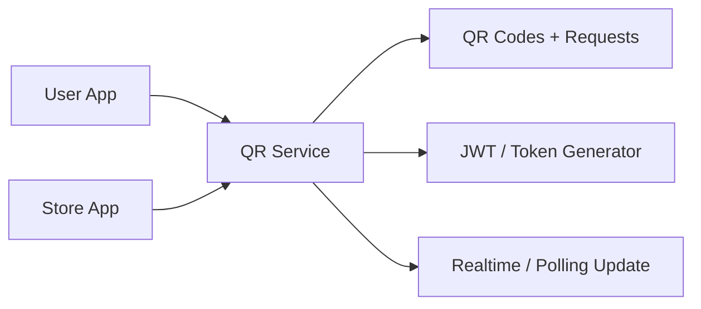

# 18. QR Connection and Scan Journey

## What this feature does
This feature supports QR-based interactions between user and store, such as secure connection requests, scan events, session-like approvals, and expiry handling.

## Real Aurum signals behind this topic
- Controllers: `QRCodeController`, `QRConnectionController`, `QRScanInternalController`
- Entities: `QRCodesEntity`, `QRConnectionRequestEntity`, `QRScanRequestEntity`
- Migrations: generalized QR connection requests and scan-request timestamp defaults

## Why it is a great interview topic
- It combines token generation, short-lived state, mobile UX, and security.

## Architecture

## Flow
1. QR code is generated for a user or store entity.
2. Scanner reads the token.
3. Service validates token and creates a connection or scan request.
4. Request remains pending for a short expiry window.
5. Owner approves or rejects.
6. Final linked action is completed.

## Schema
- `qr_codes`
  - `id`, `qr_type`, `entity_id`, `qr_token`, `is_active`, `expires_at`
- `qr_connection_requests`
  - `id`, `user_id`, `store_id`, `status`, `request_type`, `expires_at`
- `qr_scan_requests`
  - `id`, `status`, `request_type`, `qr_type`
  - `scanned_entity_id`, `scanner_user_id`, `owner_user_id`
  - `metadata`, `responded_at`, `expires_at`

## Deep design concepts
- `Short-lived credentials`
- `Replay protection`
- `Approval-based pairing`
- `Mobile-friendly stateless token plus stateful request record`

## Security notes
- Token should be signed and time-bound.
- Sensitive action should depend on server-side request status, not only the QR payload.

## How to explain in interview
Say: "The QR payload should stay lightweight and signed, while the real business state should live in the backend request tables. That avoids replay attacks and gives proper approval flow."
