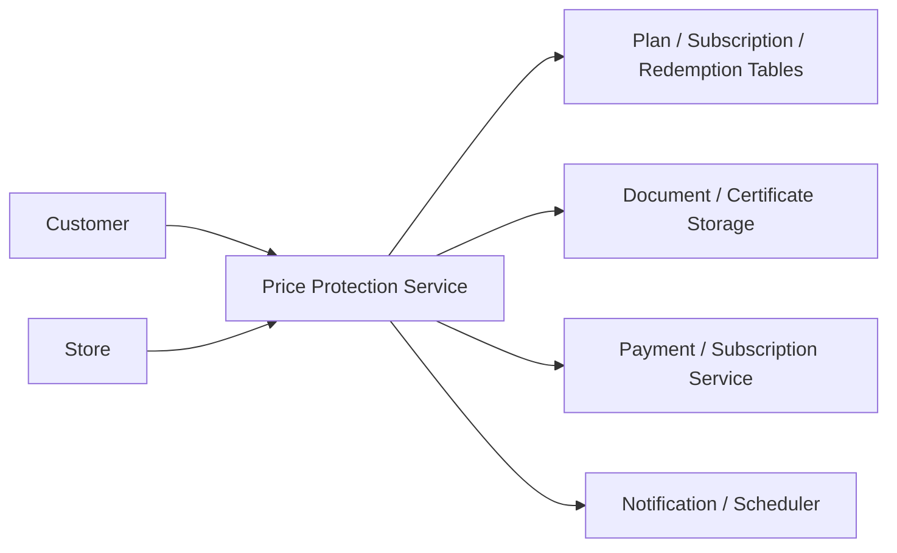

# 19. Price Protection Platform

## What this feature does
This feature lets customers subscribe to a plan that protects them from price changes for certain products or categories. It supports plan catalog, subscriptions, documents, redemptions, settlement, and usage tracking.

## Real Aurum signals behind this topic
- Controllers: `PriceProtectionController`, `SuperAdminPriceProtectionController`, `StorePPRecommendationsController`
- Entities: `PriceProtectionPlanEntity`, `PriceProtectionSubscriptionEntity`, `PriceProtectionRedemptionEntity`, `PriceProtectionRedemptionProductEntity`
- Many dedicated migrations show this is a rich business capability

## Why this is one of the best interview topics
- It is a full mini-platform with planing, subscription, documents, redemption, and finance logic.
- It is perfect for discussing domain modeling and workflow-heavy system design.

## Architecture

## Main flow
1. Admin creates a price-protection plan.
2. Customer subscribes at a store or branch.
3. System stores certificate/document status.
4. Customer later redeems protection.
5. System evaluates products and settlement values.
6. Redemption records and attachments are stored for audit.

## Database schema
- `price_protection_plans`
  - `id`, `plan_name`, `plan_code`, `store_id`, `created_by_type`
  - `validity_months`, `start_at`, `end_at`
  - `description`, `terms_conditions`, `monthly_risk_limit`, `max_risk_amount`
  - `metal_id`, `metal_type_id`, `category_id`, `plan_category_id`
  - `is_all_categories`, `is_all_sub_categories`, `version`, `is_active_version`
- `price_protection_subscriptions`
  - `subscription_id`, `user_plan_id`, `customer_id`, `plan_id`
  - `start_date`, `end_date`, `status`, `store_id`, `branch_id`
  - `certificate_id`, `document_status`
- `price_protection_redemptions`
  - `redemption_id`, `subscription_id`, `branch_id`, `redemption_date`, `redemption_type`, `remarks`
- `price_protection_redemption_products`
  - `redemption_product_id`, `redemption_id`, `subscription_product_id`, `product_version_id`
  - `gross_weight`, `stone_weight`, `net_weight`, `rate_per_gram`, `evaluated_gold_value`

## System design concepts
- `Versioned plan catalog`
- `Workflow-rich redemption lifecycle`
- `Document tracking`
- `Financial evaluation and settlement`
- `Store-specific product eligibility`

## Interview tradeoffs
- Real-time valuation gives fresh accuracy but depends on external price feeds.
- Snapshot valuation is simpler but may be less fair depending on business rules.

## How to explain in interview
Say: "I would design price protection as a platform, not a single API. It needs a plan catalog, subscription engine, redemption workflow, and valuation-aware settlement model."
