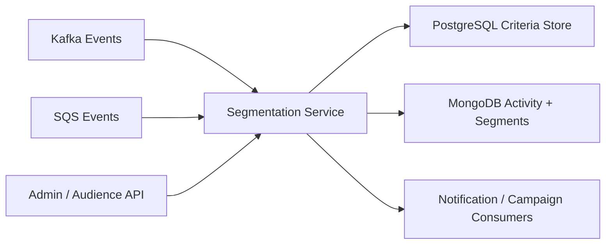

# 20. User Segmentation Engine

## What this feature does
This feature classifies users into segments using profile attributes and activity events. It stores criteria in PostgreSQL and high-volume event or segment materialization in MongoDB. It also appears to use Kafka and SQS inputs.

## Real Aurum signals behind this topic
- Controllers: `AudienceController`, `UserSegmentationController`, `UserActivityController`, `UserCriteriaController`, `PolicyTriggerController`, `NotificationFilterController`
- Documents: `UserSegmentationDocument`, `UserActivityEventDocument`
- Entity: `UserCriteriaEntity`
- Packages show Kafka listener, SQS listener, Mongo adapter, Postgres adapter, TTL policies, and schedulers

## Why this is a top-end interview topic
- It combines streaming, document storage, criteria modeling, and downstream targeting.

## Architecture

## Main flow
1. User activity arrives from Kafka or SQS.
2. Service stores raw or normalized activity events in MongoDB.
3. Criteria definitions are loaded from PostgreSQL.
4. Rules are evaluated and segment tags are updated.
5. Audience APIs expose matching users for campaigns or analytics.

## Database schema
- `user_criteria`
  - `criteria_id`, `field`, `display_value`, `unique_values`, `is_active`
  - `created_at`, `updated_at`
- `user_activity_events` in MongoDB
  - `id`, `user_id`, `event_type`, `source_service`
  - `metadata`, `event_time`, `trace_id`, `ip_address`, `user_agent`
- `user_segmentation` in MongoDB
  - `id`, `user_id`
  - `static_attributes`, `dynamic_attributes`, `tags`
  - `created_at`, `updated_at`

## Key concepts
- `Polyglot persistence`: PostgreSQL for structured criteria, MongoDB for flexible event and segment documents.
- `Streaming ingestion`
- `TTL policies` for event retention
- `Materialized user profile`
- `Audience targeting`

## Interview tradeoffs
- Compute segments on write:
  - faster reads
  - more ingest work
- Compute segments on read:
  - simpler writes
  - slower audience queries

## How to explain in interview
Say: "I would treat segmentation as a streaming plus materialization problem. Raw events are high-volume and flexible, so MongoDB works well, while stable criteria definitions stay in PostgreSQL."
