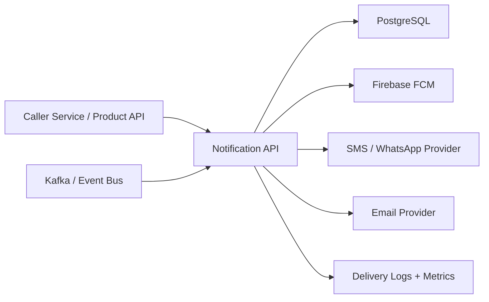

# 21. Notification Delivery Platform

## What this feature does
This feature is a central notification platform that can send notifications across multiple channels such as push, email, SMS, WhatsApp, and batch workflows. It supports both API-triggered and event-driven delivery.

## Real Aurum signals behind this topic
- Repo: `aurum-notification-service`
- API routes include:
  - `/api/v1/aurum/notification`
  - `/batch`
  - `/fcm/token`
  - `/fcm/direct-push`
- Go packages show:
  - notification facade
  - Kafka handlers
  - cron worker
  - email templates
  - push delivery logs
  - notification event repository

## Why this is a high-value interview topic
- It is a classic distributed-system problem.
- It includes fanout, multi-channel delivery, retries, templates, logging, and observability.

## Architecture

## Key APIs and flows
1. Product system sends notification request or batch request.
2. Notification service validates payload and event types.
3. Service stores notification event and log records.
4. Service dispatches to channel-specific senders.
5. Delivery outcome is stored in push or detail logs.
6. Downstream analytics or monitoring reads delivery status.

## Schema and domain model
- `notification_events`
  - `event_id`, `event_name`, `user_id`, `event_metadata`, timestamps
- `notification_details_logs`
  - payload, message type, status, retries
- `notification_push_delivery_logs`
  - user id, FCM token, delivery status, error code, run id
- `email_templates`
  - template name, subject, body
- device token repository
  - maps users to valid push tokens

## Tech stack used
- Go 1.24
- Gin
- PostgreSQL with `sqlx` / `pgx`
- Kafka
- Firebase FCM
- AWS SDK modules
- Prometheus
- OpenTelemetry

## System design concepts
- `Multi-channel abstraction`
- `Event-driven fanout`
- `Delivery observability`
- `Failure isolation per channel`
- `Synchronous versus asynchronous send`

## Interview tradeoffs
- Sync send gives instant response but higher latency.
- Async send gives better throughput and resilience but needs status polling.
- Best design: accept request quickly, persist event, dispatch asynchronously, store delivery outcome.

## How to explain in interview
Say: "I would treat notifications as a platform, not helper code inside every service. The platform should abstract channels, persist intent, track delivery, and decouple product systems from provider-specific complexity."
