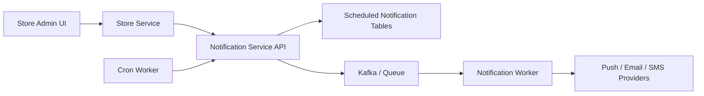

# 22. Scheduled Notification Campaigns

## What this feature does
This feature lets teams create one-time or recurring notification campaigns with cron expressions, targeted audiences, notification payload builders, active/inactive state, and per-run analytics.

## Real Aurum signals behind this topic
- Store-side controller: `ScheduleNotificationController`
- Notification-service endpoints:
  - `/schedule-notification`
  - `/fetch-notifications`
  - `/update-notification/status/:id`
  - run analytics endpoints for super admin
- Domain entities:
  - `ScheduledNotification`
  - `NotificationFilter`
  - `NotificationPayloadBuilder`
  - `NotificationRun`

## Why this is interview-worthy
- It combines campaign definition, cron scheduling, targeting, fanout, and run-level analytics.
- It is very close to real CRM or engagement systems used in product companies.

## Architecture

## Data model
- `scheduled_notifications`
  - `id`, `store_id`, `notification_name`, `cron_expression`
  - `last_run`, `next_run`
  - `notification_type[]`
  - `is_saved_to_draft`, `is_active`, `location`
- `notification_filters`
  - `scheduled_notification_id`, `data_source`, `filters`, `audience_ids`
- `notification_payload_builders`
  - `scheduled_notification_id`, `notification_payload`, `notification_type`, `event_name`
- `notification_runs`
  - `run_id`, `scheduled_notification_id`, `status`
  - `run_initiated_at`, `run_finished_at`
  - `total_users_targeted`, `successful_deliveries`, `failed_deliveries`

## Main flow
1. Admin creates campaign definition.
2. Service stores campaign, filter, and payload builder in one transaction.
3. Cron worker finds due campaigns using `next_run`.
4. Worker publishes a message for execution.
5. Worker resolves audience and sends notifications.
6. Run table and delivery logs capture performance.

## Strong design concepts
- `Scheduler + worker separation`
- `Per-run analytics`
- `Exactly-once business effect is not guaranteed, so idempotent run execution is important`
- `Targeting and payload are stored separately`
- `Immediate send as a special case of scheduled send`

## Failure handling
- Cron worker crashes after scheduling: use durable run records.
- One campaign fails partially: keep per-user delivery logs.
- Invalid cron: reject at write time.

## How to explain in interview
Say: "I would store the campaign definition, the audience filter, and the payload separately, then let a cron worker create durable run records and push the actual fanout to asynchronous workers."
