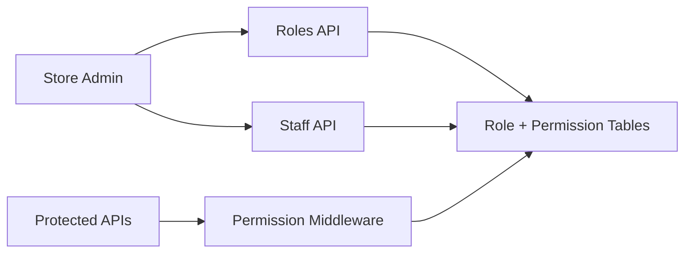

# 23. Role-Based Access Control

## What this feature does
This feature allows each store to define roles, attach page-level permissions, and assign operational access to staff. It is a real RBAC system built around store operations.

## Real Aurum signals behind this topic
- Controllers: `StoreRolesController`, `StaffController`
- Entities:
  - `AurumStoreRolesEntity`
  - `RoleInformationEntity`
  - `RolePermissionsResponseEntity`
  - `SelectedRolePermissionsEntity`
- APIs include role creation, update, permission listing, staff creation, staff search, and accessible branches

## Why interviewers like this topic
- It shows you understand authorization modeling beyond simple login.
- It introduces permission hierarchies, resource scoping, and admin tooling.

## Architecture

## Schema and model
- `store_roles`
  - `role_id`, `role_name`, `permissions`
- `role_information`
  - role name, description, role type
  - selected page-permission mappings
- `selected_role_permissions`
  - `page_identifier`, `page_display_name`, `permission_ids`
- staff mappings
  - staff-to-role
  - staff-to-branch
  - staff activity and status

## Main capabilities
- create role permission sets
- update role permission sets
- fetch allowed pages and actions
- create and update staff
- search staff
- fetch staff-accessible branches

## System design concepts
- `RBAC versus ABAC`
- `Page-action permission model`
- `Operational admin APIs`
- `Resource scoping by store and branch`
- `Permission caching opportunities`

## Interview tradeoffs
- Flat permissions are simple but hard to manage at scale.
- Role bundles are cleaner but less flexible for exceptions.
- Good design uses roles for the default path and custom checks for exceptions.

## How to explain in interview
Say: "I would separate authentication from authorization. Authentication tells me who the user is, while RBAC tells me what they can do inside a given store context."
