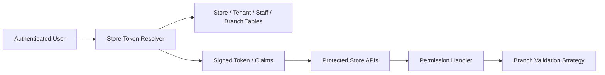

# 24. Store Token and Branch-Scoped Permissions

## What this feature does
This feature resolves store-specific token claims such as store id, branch id, role, permissions, subscribed features, and whether the user is a store super admin. It also validates branch-level access for protected APIs.

## Real Aurum signals behind this topic
- Controller: `StoreTokenGenerationController`
- DTO: `StoreTokenPermissionsDTO`
- Permission components:
  - `StorePermissionHandler`
  - `PermissionProcessor`
  - `BranchValidationGenerator`
- Token DTO fields include:
  - `userId`, `staffId`, `isSuperAdmin`, `storeId`, `branchId`, `roleName`
  - `permissions`, `planCode`, `subscribedFeatures`, `referralCode`

## Why this is a strong interview topic
- It is not just RBAC; it is scoped authorization for a multi-tenant, multi-branch product.
- It shows how token claims can reduce repeated permission lookups while still preserving server-side validation.

## Architecture

## Core data model
- `token_store_user_info`
  - store id, creator user id
- `token_role_permissions`
  - role name, `Map<Page, Actions>`
- `StoreTokenPermissionsDTO`
  - user identity, staff identity, super-admin flag
  - selected branch, role name, permissions map
  - plan code and subscribed features

## Main flow
1. User enters a store context using host or store id.
2. Service resolves tenant/store from domain prefix.
3. Service resolves staff record and whether the user is super admin.
4. Service gathers permissions and branch list.
5. Protected APIs compare request attributes with token claims.
6. For branch-sensitive actions, a custom validator checks branch-specific allowed actions.

## Deep concepts
- `Scoped claims`
- `Header/token projection of permissions`
- `Defense in depth`: token claim + server-side branch validation
- `Tenant-aware host resolution`
- `Plan and feature claims mixed with permission claims`

## Interview tradeoffs
- Rich tokens reduce DB reads but can become stale.
- DB lookup on every call is fresh but slower.
- Best practice is short-lived signed claims plus backend validation for sensitive operations.

## How to explain in interview
Say: "I would project frequently needed store permissions into a signed token or headers, but still keep server-side validation for sensitive branch-scoped operations so stale claims cannot grant unsafe access."
