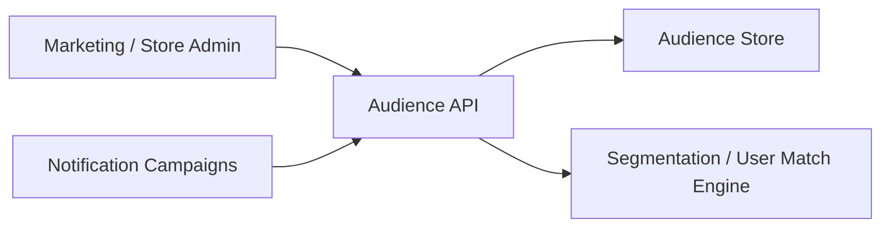

# 25. Audience Management and Targeting

## What this feature does
This feature lets store teams define reusable audiences, fetch them, update them, count matching users, and retrieve users by audience ids. It acts as a targeting layer above segmentation data.

## Real Aurum signals behind this topic
- Controller: `AudienceController`
- Entity: `AudienceEntity`
- Important fields: `id`, `name`, `description`, `filters`
- APIs include:
  - create audience
  - fetch audience list
  - update audience
  - deactivate audience
  - count users
  - get users
  - check user-audience matches

## Why it is interview-worthy
- It is a practical layer on top of a segmentation engine.
- It brings together saved filters, targeting, and campaign reuse.

## Architecture

## Data model
- `audiences`
  - `id`, `name`, `description`, `filters`
- `filters`
  - JSON-style conditions on location, activity, lifecycle stage, or segmentation tags

## Main flow
1. Admin defines an audience using filter rules.
2. System stores the audience as a reusable object.
3. Campaign systems reference audience ids instead of rebuilding rules every time.
4. Matching user count and user list APIs are used for preview and execution.

## Design concepts
- `Reusable saved targeting`
- `Filter JSON versus normalized criteria tables`
- `Preview before send`
- `Audience deactivation instead of hard delete`

## Interview tradeoffs
- Dynamic evaluation gives fresher targeting.
- Materialized audience membership gives faster campaign execution.
- Many systems use both: dynamic for preview, materialized snapshots for large runs.

## How to explain in interview
Say: "Segmentation computes user attributes or tags, while audience management packages those rules into reusable marketing segments that campaign systems can consume safely."
