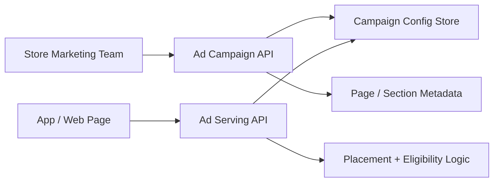

# 26. Store Ad Campaign Platform

## What this feature does
This feature lets stores create and manage ad campaigns for app pages and sections, with page-aware inventory, asset types, counts, and permission-controlled campaign management.

## Real Aurum signals behind this topic
- Controller: `StoreAdCampaignController`
- APIs cover:
  - create and update ad campaigns
  - fetch campaign details
  - list campaigns
  - get ad types and asset categories
  - get ads count by page
  - fetch page ads
  - page and section metadata lookup
- Protected by `RequirePermission` and feature gating (`FEATURE_STORE_ADS`)

## Why this can impress an interviewer
- It is a monetization/inventory management problem.
- It combines permissions, placement inventory, campaign targeting, and content serving.

## Architecture

## Main concepts
- `Ad inventory by page and section`
- `Campaign configuration and asset metadata`
- `Serving-time filtering`
- `Feature gating + permission checks`
- `Analytics-ready structure`

## Likely data model areas
- campaign
- asset category and asset type
- page metadata
- page-section mapping
- serving rules by app id, page id, device type, section id

## Interview tradeoffs
- Full ad server complexity is large; many products begin with rule-based serving.
- Precomputed eligible ads give faster reads, but dynamic filtering is more flexible.

## How to explain in interview
Say: "I would separate campaign management from ad serving. The write side defines assets, pages, and rules; the read side returns only the eligible ads for the current app page and section."
