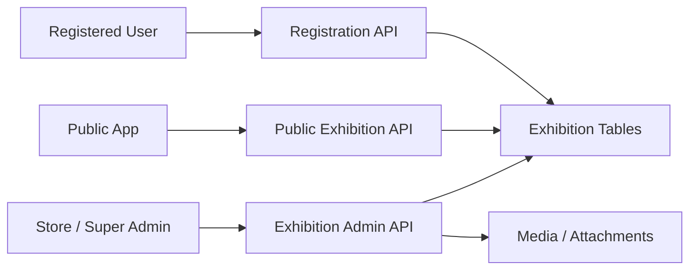

# 27. Exhibition and Event Management

## What this feature does
This feature manages exhibitions or events for stores and non-store entities, including event creation, media, venue data, public discovery, and user registration tracking.

## Real Aurum signals behind this topic
- Controllers:
  - `AurumStoreExhibitionController`
  - `AurumSuperAdminExhibitionController`
  - `ExhibitionPublicController`
  - `ExhibitionUserRegistrationController`
- Entities:
  - `AurumStoreExhibitionEntity`
  - `ExhibitionUserRegistrationEntity`

## Why it is interview-worthy
- It combines admin management, public read APIs, and event registration workflows.
- It is a good example of lifecycle-heavy event systems.

## Architecture

## Data model
- `aurum_store_exhibitions`
  - `id`, `name`, `description`, `venue`, `location`
  - state and city identifiers
  - store id / non-store linkage
  - `event_type`, media, active flag
  - start and end timestamps
  - registration count
- `exhibition_user_registrations`
  - `id`, `exhibition_id`, `user_id`
  - `registration_status`
  - registration date and timestamps

## Main design concepts
- `Public and private API split`
- `Event lifecycle`
- `Registration idempotency`
- `Media and attachment decoupling`
- `Count tracking and analytics`

## Interview extension
You can expand this to:
- ticketing
- capacity limits
- waitlists
- QR check-in
- notification reminders

## How to explain in interview
Say: "This is an event-management system with two major planes: admin-side event publishing and public-side discovery plus registration. I would keep those read/write concerns separate and track registration state explicitly."
