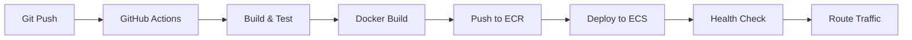

# AWS Cloud Deployments & Docker - Interview Explanation

## Resume Line
> "Managed AWS cloud deployments and monitored application performance while maintaining containerized environments using Docker to ensure scalable and reliable operations."

---

## Infrastructure Overview

### AWS Architecture

```
┌─────────────────────────────────────────────────────────────────────┐
│                         AWS Cloud                                    │
│  ┌──────────────┐    ┌──────────────┐    ┌──────────────┐          │
│  │   Route 53   │───▶│     ALB      │───▶│   ECS/EKS    │          │
│  │  (DNS)       │    │ (Load Bal.)  │    │  (Containers)│          │
│  └──────────────┘    └──────────────┘    └──────────────┘          │
│                                                │                     │
│         ┌──────────────────────────────────────┼──────────┐         │
│         │                                      ▼          │         │
│         │    ┌──────────┐  ┌──────────┐  ┌──────────┐    │         │
│         │    │  S3      │  │   SQS    │  │  RDS/    │    │         │
│         │    │ (Files)  │  │ (Queue)  │  │ MongoDB  │    │         │
│         │    └──────────┘  └──────────┘  └──────────┘    │         │
│         │                                                 │         │
│         │    ┌──────────┐  ┌──────────┐  ┌──────────┐    │         │
│         │    │CloudWatch│  │   KMS    │  │ Secrets  │    │         │
│         │    │(Monitors)│  │(Encrypt) │  │ Manager  │    │         │
│         │    └──────────┘  └──────────┘  └──────────┘    │         │
│         └────────────────────────────────────────────────┘         │
└─────────────────────────────────────────────────────────────────────┘
```

---

## Docker Containerization

### Dockerfile Structure

```dockerfile
# Multi-stage build for optimized image size
FROM eclipse-temurin:21-jdk-alpine AS builder
WORKDIR /app
COPY . .
RUN ./gradlew bootJar --no-daemon

FROM eclipse-temurin:21-jre-alpine
WORKDIR /app

# Security: Non-root user
RUN addgroup -S appgroup && adduser -S appuser -G appgroup
USER appuser

# Copy only the JAR (smaller image)
COPY --from=builder /app/build/libs/*.jar app.jar

# Health check
HEALTHCHECK --interval=30s --timeout=3s \
  CMD wget -q --spider http://localhost:8080/actuator/health || exit 1

EXPOSE 8080
ENTRYPOINT ["java", "-jar", "app.jar"]
```

### Key Docker Practices

| Practice | Implementation | Benefit |
|----------|---------------|---------|
| **Multi-stage builds** | Separate build and runtime stages | Image size: 400MB → 150MB |
| **Alpine base** | `eclipse-temurin:21-jre-alpine` | Smaller attack surface |
| **Non-root user** | `adduser -S appuser` | Security hardening |
| **Health checks** | HEALTHCHECK instruction | Container orchestration support |
| **Layer caching** | Dependencies copied before source | Faster rebuilds |

### Image Size Optimization

```
Before Optimization:    650 MB (full JDK + build tools)
After Optimization:     150 MB (JRE-alpine + multi-stage)
Reduction:              ~77%
```

---

## AWS Deployment Pipeline

### CI/CD Flow



### Deployment Steps

```yaml
# GitHub Actions / AWS CodePipeline steps
1. Code checkout
2. Run unit tests
3. Build JAR (./gradlew bootJar)
4. Build Docker image
5. Push to Amazon ECR
6. Update ECS task definition
7. Rolling deployment (zero downtime)
8. Health check validation
9. Rollback on failure
```

### ECS Task Definition (Key Parts)

```json
{
  "family": "workflow-processing-service",
  "cpu": "1024",
  "memory": "2048",
  "containerDefinitions": [
    {
      "name": "app",
      "image": "123456789.dkr.ecr.us-east-1.amazonaws.com/wps:latest",
      "portMappings": [{ "containerPort": 8080 }],
      "healthCheck": {
        "command": ["CMD-SHELL", "curl -f http://localhost:8080/actuator/health"],
        "interval": 30,
        "timeout": 5,
        "retries": 3
      },
      "logConfiguration": {
        "logDriver": "awslogs",
        "options": {
          "awslogs-group": "/ecs/workflow-processing-service",
          "awslogs-region": "us-east-1"
        }
      },
      "environment": [
        { "name": "SPRING_PROFILES_ACTIVE", "value": "prod" }
      ],
      "secrets": [
        { "name": "DB_PASSWORD", "valueFrom": "arn:aws:secretsmanager:..." }
      ]
    }
  ]
}
```

---

## Monitoring & Observability

### CloudWatch Metrics Tracked

| Metric | Threshold | Alert Action |
|--------|-----------|--------------|
| **CPU Utilization** | > 80% for 5 min | Scale out + notify |
| **Memory Utilization** | > 85% for 5 min | Scale out + notify |
| **Request Latency P99** | > 500ms | Notify on-call |
| **Error Rate (5xx)** | > 1% | Page on-call |
| **SQS Queue Depth** | > 1000 messages | Scale out consumers |
| **Container Health** | Unhealthy | Auto-replace task |

### CloudWatch Dashboard

```
┌─────────────────────────────────────────────────────────────┐
│                 Service Health Dashboard                     │
├──────────────────────┬──────────────────────────────────────┤
│  CPU Usage (%)       │  Memory Usage (%)                    │
│  ████████░░ 78%     │  ██████████░ 82%                     │
├──────────────────────┼──────────────────────────────────────┤
│  Request Rate        │  Error Rate                          │
│  1,250 req/min       │  0.02%                               │
├──────────────────────┼──────────────────────────────────────┤
│  P50 Latency: 45ms   │  P99 Latency: 180ms                  │
├──────────────────────┴──────────────────────────────────────┤
│  Active Tasks: 5     │  Desired: 5  │  Running: 5          │
└─────────────────────────────────────────────────────────────┘
```

### Log Aggregation

```java
// Structured logging with correlation IDs
log.info("Processing workflow",
    Map.of(
        "traceId", MDC.get("traceId"),
        "workflowId", workflowId,
        "fileName", fileName,
        "stepType", stepType
    ));
```

**CloudWatch Insights Query:**
```sql
fields @timestamp, @message
| filter traceId = "abc-123"
| sort @timestamp asc
| limit 100
```

---

## Auto-Scaling Configuration

### ECS Service Auto-Scaling

```yaml
Scaling Policy:
  Target Tracking:
    - Metric: ECSServiceAverageCPUUtilization
      Target: 70%
    - Metric: ECSServiceAverageMemoryUtilization  
      Target: 75%
  
  Min Capacity: 2
  Max Capacity: 10
  Scale Out Cooldown: 60 seconds
  Scale In Cooldown: 300 seconds
```

### Scaling Events (Sample)

| Time | Event | Tasks | Trigger |
|------|-------|-------|---------|
| 09:00 | Scale out | 2 → 4 | CPU > 70% |
| 09:15 | Scale out | 4 → 6 | SQS depth > 500 |
| 11:00 | Steady | 6 | Normal load |
| 18:00 | Scale in | 6 → 3 | CPU < 40% for 15min |
| 22:00 | Scale in | 3 → 2 | Minimum capacity |

---

## Reliability Practices

### Zero-Downtime Deployments

```
Rolling Update Strategy:
├── Minimum Healthy: 100%
├── Maximum: 200%
├── Deployment batches: 1 task at a time
└── Health check grace period: 60 seconds

Deployment Flow:
1. Launch new task with new image
2. Wait for health check pass
3. Register with load balancer
4. Drain old task (30s connection draining)
5. Terminate old task
6. Repeat for remaining tasks
```

### Disaster Recovery

| Component | Strategy | RTO | RPO |
|-----------|----------|-----|-----|
| **Application** | Multi-AZ ECS | < 1 min | 0 |
| **Database** | MongoDB Atlas (replica set) | < 5 min | < 1 min |
| **S3 Files** | Cross-region replication | 0 | < 15 min |
| **Secrets** | Multi-region Secrets Manager | < 1 min | 0 |

---

## Interview Q&A

### Q1: Describe your deployment process.

**Answer:**
"We use a CI/CD pipeline with GitHub Actions:
1. Push triggers automated build and tests
2. Docker image built using multi-stage Dockerfile
3. Image pushed to Amazon ECR
4. ECS task definition updated with new image tag
5. Rolling deployment ensures zero downtime
6. Health checks validate before routing traffic
7. Automatic rollback on failed health checks"

### Q2: How do you handle container failures?

**Answer:**
"Multiple layers of resilience:
1. **Container health checks**: ECS replaces unhealthy containers automatically
2. **Application health endpoints**: Spring Actuator `/actuator/health`
3. **Load balancer health checks**: ALB removes unhealthy targets
4. **Auto-scaling**: Maintains desired task count
5. **Deployment rollback**: Reverts to previous version on failures"

### Q3: What monitoring do you have in place?

**Answer:**
"Comprehensive observability stack:
- **CloudWatch Metrics**: CPU, memory, request latency, error rates
- **CloudWatch Logs**: Centralized structured logging with trace IDs
- **CloudWatch Alarms**: Automated alerting for thresholds
- **X-Ray (optional)**: Distributed tracing across services
- **Custom Dashboards**: Real-time service health visualization"

### Q4: How do you optimize Docker images?

**Answer:**
"Several techniques:
1. **Multi-stage builds**: Separate build tools from runtime
2. **Alpine base images**: Minimal OS layer (~5MB vs ~80MB)
3. **JRE instead of JDK**: Only runtime needed in production
4. **Layer ordering**: Dependencies before source code for caching
5. **Result**: Reduced image from 650MB to 150MB (77% reduction)"

### Q5: How do you handle secrets in containers?

**Answer:**
"Never embed secrets in images:
- **AWS Secrets Manager**: Store database passwords, API keys
- **ECS secrets integration**: Inject at runtime via task definition
- **Environment-specific**: Different secrets per environment
- **Rotation**: Secrets Manager supports automatic rotation"

### Q6: What's your auto-scaling strategy?

**Answer:**
"Target tracking with multiple metrics:
- Scale out when CPU > 70% or Memory > 75%
- Scale out when SQS queue depth > 500 (custom metric)
- Minimum 2 tasks for high availability
- Maximum 10 tasks for cost control
- Cooldown periods to prevent thrashing (60s out, 300s in)"

---

## Key Numbers to Remember

| Metric | Value |
|--------|-------|
| Container startup time | ~2.5 seconds |
| Docker image size | 150 MB (optimized) |
| Deployment time (rolling) | ~5 minutes |
| Health check interval | 30 seconds |
| Auto-scale out time | ~90 seconds |
| Minimum running tasks | 2 (HA) |
| Maximum tasks | 10 |
| Target CPU utilization | 70% |
| Monthly uptime SLA | 99.9% |

---

## Summary for Interview

**What I Did:**
- Built and maintained Docker images with multi-stage builds
- Deployed services to AWS ECS with rolling updates
- Configured auto-scaling based on CPU, memory, and SQS metrics
- Set up CloudWatch dashboards and alerts for monitoring
- Implemented zero-downtime deployment pipelines

**Impact:**
- Reduced container image size by 77% (650MB → 150MB)
- Achieved 99.9% uptime SLA
- Auto-scaling handled 5x traffic spikes without manual intervention
- Mean time to deploy: 5 minutes
- Mean time to detect issues: < 1 minute (CloudWatch alerts)
