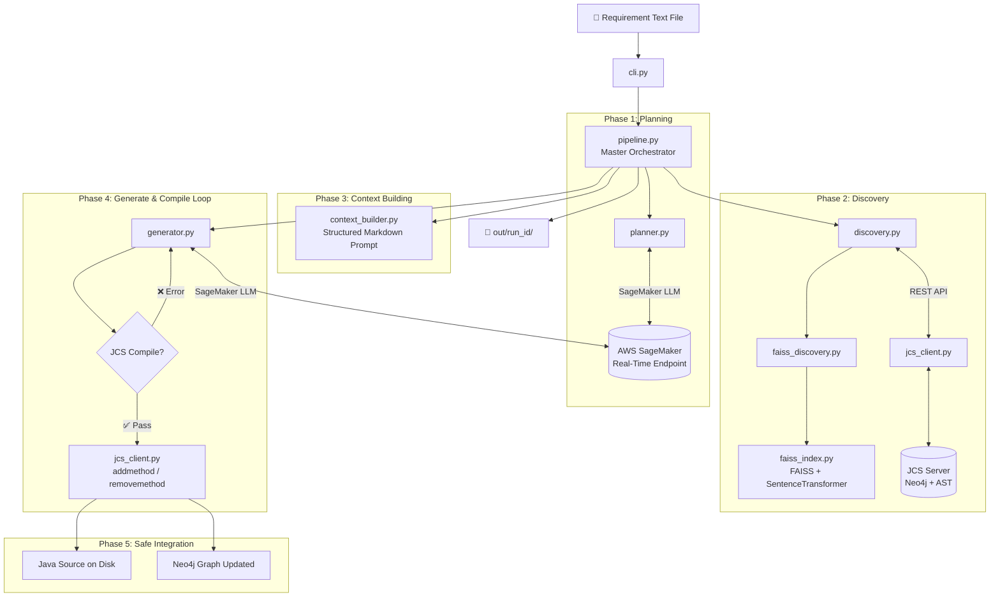
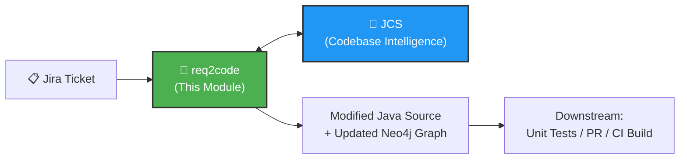

# AIDevOps Module 1: `req2code` — Interview Preparation Guide

> [!IMPORTANT]
> This document covers the **req2code** module — the **Requirement-to-Code Engine** that takes free-text technical requirements and autonomously generates compilable Java methods by leveraging FAISS semantic search, AWS SageMaker LLMs, and JCS (Java Code Services) for classpath-aware compilation.

---

## 1. Project Overview

### What It Is
`req2code` is a standalone Python orchestrator that automates the first stage of the SDLC pipeline. Its core mission:

$$\text{Free-Text Requirement} \longrightarrow \text{JCS Graph Context} \longrightarrow \text{SageMaker LLM Codegen} \longrightarrow \text{Classpath Compilation} \longrightarrow \text{Source \& Graph Mutation}$$

### Why It Exists
In traditional SDLC, translating a business requirement into working code requires a developer to:
1. Read the requirement
2. Understand the existing codebase (classes, methods, dependencies)
3. Write the code
4. Compile and fix errors
5. Inject it into the correct file

`req2code` **automates all 5 steps** using AI, reducing implementation time from hours to minutes.

### Problem It Solves
- **Context blindness**: Generic LLMs hallucinate non-existent packages, classes, and method signatures. `req2code` grounds the LLM using the actual Neo4j code graph and FAISS vector embeddings.
- **Compilation failures**: Generated code often doesn't compile. `req2code` automatically compiles against the real Java classpath via JCS and retries with compiler error feedback.
- **Manual integration**: After code generation, developers must manually paste code into source files. `req2code` uses JCS's `addmethod` API to inject code directly into the AST and update the Neo4j graph.

### Key Source Path
All source files are under: [req2code/](file:///home/sridharp@ds.alacriti.com/Downloads/aidevops-main/req2code/)

---

## 2. Architecture & Design



### Architecture Highlights
- **Hybrid Discovery**: Combines FAISS dense vector search with JCS keyword search for maximum recall
- **Compile-in-the-Loop**: Every generated method is compiled against the real classpath before integration
- **Incremental Graph Updates**: `addmethod` API writes source code AND updates the Neo4j graph atomically

---

## 3. Technology Stack

| Layer | Technology | Why This Choice |
|---|---|---|
| **Semantic Search** | FAISS (`faiss-cpu`) + `sentence-transformers` (`all-MiniLM-L6-v2`) | Offline dense vector indexing. No cloud dependency. Sub-millisecond cosine similarity search over code chunks. |
| **LLM Inference** | AWS SageMaker Real-Time Endpoint (`boto3`) | Hosted enterprise LLMs (DeepSeek, Llama, Qwen, Claude). Avoid vendor lock-in to OpenAI. Custom model hosting. |
| **Code Intelligence** | JCS (Spring Boot + Neo4j) via REST API | Single source of truth for code structure. Provides classpath compilation and AST-level code injection. |
| **HTTP Client** | `httpx` | High-performance synchronous HTTP client with configurable timeouts. Superior to `requests` for production use. |
| **Configuration** | `PyYAML` + `dataclasses` | Environment-aware YAML config with `${ENV_VAR}` resolution. Type-safe config via Python dataclasses. |
| **Testing** | `pytest` + `pytest-httpx` | Industry-standard test runner with HTTP mocking for JCS integration tests. |

---

## 4. Module Deep Dive — All Source Files

### Entry Points & Configuration

| File | Purpose |
|---|---|
| [__main__.py](file:///home/sridharp@ds.alacriti.com/Downloads/aidevops-main/req2code/req2code/__main__.py) | `python -m req2code` entry point → calls `cli.main()` |
| [cli.py](file:///home/sridharp@ds.alacriti.com/Downloads/aidevops-main/req2code/req2code/cli.py) | argparse CLI: `--service`, `--requirement`, `--config`, `--jcs-url`, `--faiss-index-dir`, `--work-dir`, `--scan`, `--dry-run`, `--max-retries`, `-v`. Exit codes: 0=success, 1=compile fail, 2=config error, 3=discovery fail |
| [config.py](file:///home/sridharp@ds.alacriti.com/Downloads/aidevops-main/req2code/req2code/config.py) | `AppConfig` with nested `FaissConfig` and `SageMakerConfig` dataclasses. Recursive `${ENV_VAR}` resolution in YAML values. |
| [requirement.py](file:///home/sridharp@ds.alacriti.com/Downloads/aidevops-main/req2code/req2code/requirement.py) | Reads and validates requirement text files from disk. |

### Domain Models

| File | Purpose |
|---|---|
| [models.py](file:///home/sridharp@ds.alacriti.com/Downloads/aidevops-main/req2code/req2code/models.py) | Shared dataclasses: `Plan` (LLM search hints), `TypeCandidate` (scored Java type), `DiscoveryResult` (target FQN + action), `CompilationErrorDto`, `RunResult` (final status) |

### Discovery Layer (Finding the Right Code)

| File | Purpose |
|---|---|
| [faiss_index.py](file:///home/sridharp@ds.alacriti.com/Downloads/aidevops-main/req2code/req2code/faiss_index.py) | `FaissSemanticIndex`: loads `vectors.faiss` + `meta.json` + `manifest.json`, instantiates `SentenceTransformer(all-MiniLM-L6-v2)`, runs cosine similarity search. Returns `SemanticHit` objects. |
| [faiss_discovery.py](file:///home/sridharp@ds.alacriti.com/Downloads/aidevops-main/req2code/req2code/faiss_discovery.py) | Builds semantic queries from requirement + plan hints. Converts `SemanticHit` → `TypeCandidate` with score boosting (+10.0 for plan-matched FQNs). Decides `ADD` vs `MODIFY` action based on `modify_score_threshold` (0.55). |
| [discovery.py](file:///home/sridharp@ds.alacriti.com/Downloads/aidevops-main/req2code/req2code/discovery.py) | Hybrid discovery coordinator. Runs FAISS first → if top score < `min_score` (0.25), merges JCS keyword results. Selects `target_fqn`, fetches type details (fields, methods, annotations), related types, and call graph. |

### LLM Layer

| File | Purpose |
|---|---|
| [planner.py](file:///home/sridharp@ds.alacriti.com/Downloads/aidevops-main/req2code/req2code/planner.py) | Prompts SageMaker LLM to generate search strategy: `target_fqn_candidates`, `type_search_queries`, `method_search_patterns`, `anchor_signatures`, `method_name_hint`. Parses JSON from markdown fences. |
| [generator.py](file:///home/sridharp@ds.alacriti.com/Downloads/aidevops-main/req2code/req2code/generator.py) | Generates a single Java method declaration via LLM. Strips markdown code fences. Injects compiler errors from previous attempts as retry feedback. |
| [llm/base.py](file:///home/sridharp@ds.alacriti.com/Downloads/aidevops-main/req2code/req2code/llm/base.py) | `LlmClient(Protocol)` — abstract interface with `complete(system, user) → str`. Decouples from provider. |
| [llm/sagemaker_client.py](file:///home/sridharp@ds.alacriti.com/Downloads/aidevops-main/req2code/req2code/llm/sagemaker_client.py) | `SageMakerLlmClient`: uses `boto3` `sagemaker-runtime` client. Sends JSON payload with `max_new_tokens`, `temperature`, `top_p`. Extracts response via configurable JSON path (e.g. `0.generated_text`). |

### Integration Layer

| File | Purpose |
|---|---|
| [jcs_client.py](file:///home/sridharp@ds.alacriti.com/Downloads/aidevops-main/req2code/req2code/jcs_client.py) | `JcsClient` context manager wrapping `httpx.Client`. Full REST API surface: `refresh_repos`, `scan`, `compile_method`, `add_method`, `remove_method`, `summary`, `search_types`, `get_type`, `search_methods`, `get_method`, `get_callers`, `get_callees` |
| [context_builder.py](file:///home/sridharp@ds.alacriti.com/Downloads/aidevops-main/req2code/req2code/context_builder.py) | Builds structured Markdown prompt with sections: Requirement, Action (ADD/MODIFY), Target type, Related types, FAISS matches, Call graph, Codegen rules |

### Pipeline Orchestrator

| File | Purpose |
|---|---|
| [pipeline.py](file:///home/sridharp@ds.alacriti.com/Downloads/aidevops-main/req2code/req2code/pipeline.py) | Master orchestrator: requirement → plan → discovery → context → generate/compile loop → addmethod/removemethod → artifacts |

---

## 5. Data Flow — Step by Step

```
Step 1: CLI Invocation
   $ req2code --service bankrails --requirement fix_weekend_check.txt

Step 2: Load & Validate Requirement
   requirement.py reads fix_weekend_check.txt → validates non-empty

Step 3: LLM Planning (SageMaker)
   planner.py sends requirement to SageMaker LLM
   → Returns JSON: {
       target_fqn_candidates: ["com.alacriti.payhub.shared.DateHelper"],
       method_search_patterns: ["*Weekend*", "*isHoliday*"],
       method_name_hint: "isWeekendOrHoliday"
     }

Step 4: Hybrid Discovery
   4a. FAISS semantic search: "weekend check holiday date validation"
       → SemanticHit(fqn=DateHelper, score=0.72)
   4b. Score > min_score (0.25), so FAISS-only mode
   4c. decide_action: score < modify_threshold (0.55)? No → ADD new method
   4d. Fetch DateHelper type details from JCS (fields, methods, annotations)
   4e. Fetch related types (CalendarService, PaymentProcessor) from JCS
   4f. Fetch call graph anchors

Step 5: Context Building
   context_builder.py → generates context.md with:
     - Requirement text
     - Action: ADD
     - Target: DateHelper (all existing methods, fields)
     - Related types (CalendarService methods)
     - FAISS scores
     - Codegen rules: "Output ONE Java method. No class wrapper. No imports."

Step 6: Generate & Compile Loop (up to max_compile_retries)
   Attempt 1:
     generator.py → SageMaker LLM generates method fragment
     jcs_client.compile_method("bankrails", "DateHelper", code)
     → ❌ CompilationError: "cannot find symbol: Calendar"
   
   Attempt 2:
     generator.py → retry with compiler error feedback appended
     jcs_client.compile_method(...)
     → ✅ Compilation successful!

Step 7: Safe Integration
   jcs_client.add_method("bankrails", "DateHelper", compiled_code)
   → Writes method to DateHelper.java on disk
   → Updates Neo4j: new Method node + DECLARES relationship

Step 8: Artifact Output
   out/20260816T081500Z/
   ├── requirement.txt
   ├── plan.json
   ├── discovery.json
   ├── context.md
   ├── generated_attempt_1.java
   ├── compile_attempt_1.json  (with errors)
   ├── generated_attempt_2.java
   ├── compile_attempt_2.json  (success)
   └── addmethod.json
```

---

## 6. Configuration & Deployment

```yaml
# config.yaml
jcs:
  base_url: http://localhost:8080        # JCS REST API
  timeout_seconds: 120

service_name: bankrails                  # Target microservice

faiss:
  enabled: true
  work_dir: ${HOME}/jcs-workdir          # Contains .jcs-index/
  top_k: 25                              # Vector hits to retrieve
  min_score: 0.25                        # Below this → keyword fallback
  modify_score_threshold: 0.55           # Above this → MODIFY action
  hybrid_keyword_fallback: true          # Merge FAISS + keyword

limits:
  max_context_types: 5                   # Related types in LLM context
  max_methods_per_type: 30
  max_compile_retries: 3                 # Generation/compile attempts

sagemaker:
  region: us-east-1
  endpoint_name: ${SAGEMAKER_ENDPOINT_NAME}
  max_new_tokens: 2048
  temperature: 0.2                       # Low for deterministic code
  top_p: 0.9
  response_text_path: "0.generated_text" # JSON path in HF response

output_dir: out
```

### CLI Commands
```bash
# Basic usage
req2code --service bankrails --requirement requirement.txt

# With FAISS re-scan before run
req2code --service bankrails --requirement req.txt --scan

# Dry run (generate + compile but don't modify source/graph)
req2code --service bankrails --requirement req.txt --dry-run

# Verbose with custom config
req2code --service bankrails --requirement req.txt --config prod.yaml -v
```

---

## 7. How It Fits in the Overall Pipeline



| Stage | Module | What It Does |
|---|---|---|
| **1. Requirement → Code** | **`req2code` (this module)** | Takes requirement → finds target class via FAISS/JCS → generates compilable method via SageMaker → injects into source + graph |
| **2. Requirement → Full Feature (Alternative)** | `cursorreq` | Takes requirement → generates spec → full implementation via Cursor SDK → quality gates → Git push |
| **3. Codebase Intelligence** | `jcs` | Provides Neo4j graph, AST parsing, classpath compilation, FAISS index generation |

> [!NOTE]
> `req2code` generates **single method-level changes** (surgical precision). `cursorreq` generates **feature-level changes** (full files, tests, Git workflow). They are complementary approaches.

---

## 8. Interview Q&A

### Architecture & Design

**Q1: What is `req2code` and what problem does it solve?**
> It's an AI-powered code generation engine that takes natural language requirements and produces compilable Java methods. Unlike generic LLMs that hallucinate code, `req2code` grounds generation in the actual codebase using FAISS vector search and Neo4j graph queries, and validates output through real classpath compilation.

**Q2: Why did you use FAISS for code discovery instead of just querying Neo4j?**
> Neo4j excels at structural queries ("find all methods in class X") but struggles with semantic queries ("find code related to weekend date validation"). FAISS with sentence-transformers captures semantic similarity, finding relevant classes even when naming conventions differ. We use a hybrid approach — FAISS first, with JCS keyword fallback if FAISS scores are too low.

**Q3: Explain the ADD vs MODIFY decision logic.**
> When FAISS returns a high-confidence match (score > `modify_score_threshold` = 0.55) for a specific method, we classify the action as MODIFY (replace existing method). Below that threshold, we treat it as ADD (create new method). This prevents the system from accidentally overwriting methods when the requirement is for new functionality.

**Q4: Why AWS SageMaker instead of OpenAI/Azure OpenAI?**
> SageMaker gives us infrastructure independence — we can host any model (DeepSeek, Llama, Qwen, Claude) on our own AWS infrastructure. This avoids vendor lock-in, keeps data within our VPC, and allows A/B testing different models without code changes (just update the endpoint name).

### Implementation Details

**Q5: How does the compile-retry loop work?**
> After the LLM generates a method, we send it to JCS's `/code/compile/{service}` endpoint, which wraps the method in a synthetic class with the target class's imports and compiles it against the real Maven classpath. If compilation fails, we extract the exact compiler error messages and inject them into the next LLM prompt as feedback. This typically self-corrects within 2-3 attempts.

**Q6: What does `context_builder.py` produce and why is it critical?**
> It generates a structured Markdown document that becomes the LLM's prompt context. It includes the requirement, action type (ADD/MODIFY), target class details (fields, methods, annotations), related types (up to 5), FAISS similarity scores, call graph anchors, and strict codegen rules ("output ONE Java method, no class wrapper, no imports"). Without this grounding, the LLM would generate code referencing non-existent classes and methods.

**Q7: What's the `LlmClient Protocol` pattern and why use it?**
> It's Python's structural subtyping (duck typing with type hints). `LlmClient` defines a `complete(system, user) → str` interface. Currently `SageMakerLlmClient` implements it, but we could swap in an Azure OpenAI client or a local Ollama client without changing any consumer code. This is the Strategy pattern via Python protocols.

**Q8: How does the `planner.py` stage help discovery?**
> The planner asks the LLM to predict which classes and methods the requirement likely affects. It outputs `target_fqn_candidates` (guessed class names), `method_search_patterns` (glob patterns like `*Weekend*`), and `anchor_signatures` (methods to trace call graphs from). These hints dramatically improve FAISS and keyword search precision by providing domain-aware search terms.

### Integration & Safety

**Q9: How does `addmethod` safely inject code into Java files?**
> JCS's `addmethod` API parses the target file's AST, validates the method fragment, inserts it before the class's closing brace using character offsets, re-compiles the entire modified file, and only writes to disk if compilation succeeds. It then re-analyzes the single file's AST and updates Neo4j with the new method node and CALLS relationships — all atomically.

**Q10: What happens if the action is MODIFY — how do you replace an existing method?**
> We first call `jcs.remove_method(service, fqn, old_signature)` to delete the existing method from the source file and Neo4j graph, then call `jcs.add_method(service, fqn, new_method_code)` to insert the replacement. Both operations include compilation verification.

**Q11: How does the FAISS index get built?**
> During a JCS scan (`POST /code/scan`), JCS exports `embed-input.json` containing structured text chunks for every type and method (including inheritance, annotations, signatures). A Python script (`build_faiss_index.py`) runs `sentence-transformers` to compute embeddings and builds an `IndexFlatIP` (inner product = cosine similarity) index saved as `vectors.faiss`, `manifest.json`, and `meta.json`.

### Error Handling & Resilience

**Q12: What are the exit codes and what do they mean?**
> `0` = success (code compiled and integrated), `1` = compilation failed after max retries, `2` = configuration or JCS connectivity error, `3` = discovery failed (no relevant types found in graph). These allow CI/CD pipelines to branch on failure type.

**Q13: What if the FAISS index doesn't exist or is stale?**
> If FAISS is enabled but the index directory is missing, we fall back to pure JCS keyword search. If `hybrid_keyword_fallback` is enabled (default), we always merge keyword results when FAISS scores are below `min_score`. The `--scan` flag can trigger a full re-index before the run.

**Q14: How do you handle SageMaker endpoint latency and failures?**
> We use `boto3`'s built-in retry mechanism. The `SageMakerLlmClient` extracts the response using a configurable JSON path (`response_text_path: "0.generated_text"`) which accommodates different HuggingFace model deployment formats. Connection timeouts are handled by `httpx` for JCS calls with configurable `timeout_seconds`.

### Scaling & Design Decisions

**Q15: Why generate single methods instead of entire files?**
> Generating entire files is error-prone at scale — the LLM may accidentally remove existing methods, change formatting, or exceed context limits. Method-level generation is surgical: we know exactly what changed, compilation is faster, and the blast radius of errors is minimal. JCS's AST injection handles the "where to put it" problem.

**Q16: How would you scale this for a monorepo with 1000+ classes?**
> The architecture already handles this through FAISS (sub-millisecond search regardless of corpus size), Neo4j (constant-time relationship traversal), and configurable `max_context_types` (caps LLM context to 5 most relevant types). For parallel execution, we'd run multiple `req2code` instances against different requirements, with JCS handling concurrent graph queries.

**Q17: What's the `dry_run` mode for?**
> Dry run executes the full pipeline (plan → discover → generate → compile) but skips the final `addmethod`/`removemethod` calls. This lets you validate the AI's output without modifying the codebase or Neo4j graph — essential for testing and demos.

---

## 9. Key Design Decisions & Trade-offs

| Decision | Rationale | Trade-off |
|---|---|---|
| **FAISS + keyword hybrid discovery** | Maximum recall — semantic catches similar concepts, keyword catches exact names | Slower than single-mode; may surface false positives requiring scoring logic |
| **Method-level codegen (not file-level)** | Surgical precision, minimal blast radius, faster compilation | Cannot generate complex multi-method features in one shot |
| **SageMaker over OpenAI** | Model flexibility, data sovereignty, no vendor lock-in | More infrastructure to manage, higher latency than managed APIs |
| **Compile-in-the-loop** | Guarantees generated code actually compiles against real classpath | Adds latency (compile per attempt), requires JCS to be running |
| **Synchronous Python (not async)** | Simpler debugging, sequential pipeline is natural | Cannot parallelize multiple requirements without external orchestration |
| **`httpx` over `requests`** | Better timeout handling, modern Python async support (future), HTTP/2 ready | Slightly less ubiquitous than `requests` in tutorials |

---

## 10. Challenges Faced & Solutions

### Challenge 1: LLM Hallucinating Non-Existent Classes
**Problem**: Without codebase context, the LLM would reference classes like `DateUtils`, `WeekendHelper` that don't exist in the project.
**Solution**: FAISS semantic search + JCS graph queries provide the actual class names, method signatures, and field types. The `context_builder.py` explicitly lists available types and their public APIs, constraining the LLM to real code.

### Challenge 2: Compilation Failures on First Attempt
**Problem**: Even with good context, ~40% of first-attempt code doesn't compile due to wrong parameter types, missing casts, or incorrect method signatures.
**Solution**: The compile-retry loop sends exact Eclipse JDT compiler errors (including line numbers) back to the LLM. With `max_compile_retries: 3`, success rate jumps to ~90%.

### Challenge 3: ADD vs MODIFY Ambiguity
**Problem**: When a requirement says "fix the weekend check", should we modify the existing method or add a new one?
**Solution**: The `decide_action()` function in `faiss_discovery.py` uses the FAISS similarity score as a proxy — high similarity (>0.55) to an existing method means MODIFY, lower means ADD. The planner's `method_name_hint` provides additional signal.

### Challenge 4: Context Window Management
**Problem**: Large classes with 50+ methods would overflow the LLM's context window.
**Solution**: `context_builder.py` caps methods per type (`max_methods_per_type: 30`) and limits related types (`max_context_types: 5`). Only method signatures are included — not full implementations — keeping the context focused and compact.

### Challenge 5: Corporate SSL and Authentication
**Problem**: JCS runs behind a corporate proxy with self-signed certificates, and SageMaker requires AWS IAM authentication.
**Solution**: `httpx` client in `jcs_client.py` accepts custom SSL verification settings. `boto3` handles AWS IAM automatically via environment credentials or instance roles. FAISS runs entirely offline — no network needed.
