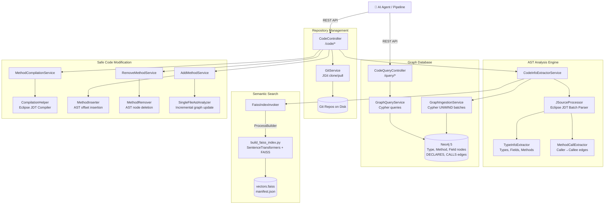
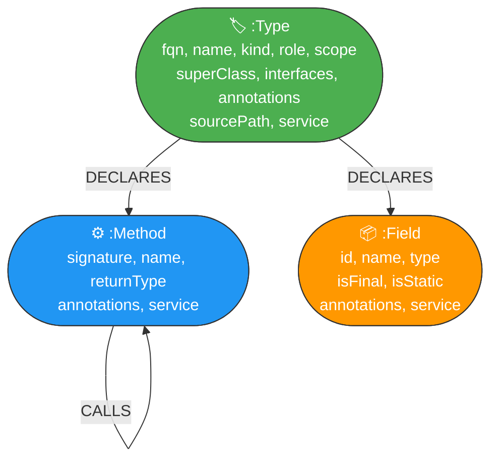
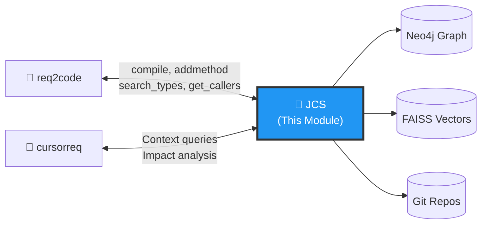

# AIDevOps Module 2: `jcs` (Java Code Services) — Interview Preparation Guide

> [!IMPORTANT]
> This document covers **JCS** — the **Codebase Intelligence Layer** that performs deep static analysis, AST extraction, semantic embedding indexing, incremental code modification, on-the-fly compilation, and graph-based architectural risk analysis across multi-repository Java codebases.

---

## 1. Project Overview

### What It Is
JCS is a **Spring Boot 3.2+ / Java 21 microservice** that serves as the central code intelligence platform for the AI DevOps pipeline. It's not just a code analyzer — it's a full **code surgery platform** that can:
- **Parse** → Extract complete ASTs from Java codebases using Eclipse JDT
- **Index** → Build Neo4j knowledge graphs AND FAISS semantic vector indices
- **Query** → Answer structural and semantic questions about the codebase
- **Compile** → Validate code snippets against the real Maven classpath
- **Modify** → Safely insert/remove methods with compilation verification and graph sync

### Why It Exists
LLM-powered coding agents need **grounded, accurate codebase context** to generate correct code. Without JCS:
- LLMs hallucinate class names, method signatures, and package structures
- Generated code fails to compile against the real classpath
- There's no safe way to inject AI-generated code into existing source files
- Impact analysis (what breaks if I change class X?) is impossible

### Problem It Solves
JCS provides the **single source of truth** for:
1. **What code exists** (graph of types, methods, fields, relationships)
2. **What code means** (semantic embeddings for similarity search)
3. **Whether new code compiles** (real classpath compilation)
4. **How to safely modify code** (AST-aware insertion/removal + graph sync)
5. **What's at risk** (prototype-to-singleton concurrency vulnerability detection)

### Key Source Path
All source files are under: [jcs/](file:///home/sridharp@ds.alacriti.com/Downloads/aidevops-main/jcs/)

---

## 2. Architecture & Design

### Service Architecture



### Neo4j Graph Schema



**Unique Constraints:**
- `(t:Type)` → unique on `(fqn, service)`
- `(m:Method)` → unique on `(signature, service)`
- `(f:Field)` → unique on `(id, service)` where `id = <TypeFQN>.<fieldName>`

---

## 3. Technology Stack

| Technology | Version | Why This Choice |
|---|---|---|
| **Java 21** | LTS | Latest LTS with virtual threads, pattern matching. Required for Eclipse JDT 3.37 compatibility. |
| **Spring Boot 3.2.7** | Stable | Enterprise-standard REST framework with dependency injection, auto-configuration, and production readiness. |
| **Eclipse JDT Core 3.37** | Latest | Industrial-strength Java parser used by Eclipse IDE itself. Full binding resolution, type inference, and compiler integration. Superior to JavaParser for classpath compilation. |
| **Neo4j 5** (via Spring Data Neo4j) | Latest | Code structures are inherently graphs. Index-free adjacency means $O(1)$ relationship traversal regardless of graph size. Call chains and impact analysis are natural graph queries. |
| **JGit 6.9** | Latest | Pure Java Git implementation — no OS-level `git` dependency. Supports corporate SSL truststore for enterprise GitLab. |
| **FAISS** (`faiss-cpu`) + `sentence-transformers` | Python | Offline semantic vector search. Sub-millisecond cosine similarity over thousands of code chunks. Complements Neo4j's structural queries with semantic understanding. |
| **Maven** | Build tool | Industry standard for Java dependency management. JCS uses Maven's `dependency:build-classpath` to generate classpath files for compilation. |
| **Lombok** | Boilerplate | `@Getter`, `@Setter`, `@Builder`, `@RequiredArgsConstructor`, `@Log4j2` — reduces verbose Java boilerplate. |

---

## 4. Module Deep Dive — 71 Java Source Files

### 4.1 Entry Point & Configuration (7 files)

| Class | Purpose |
|---|---|
| `SpringApp` | `@SpringBootApplication` main class |
| `ServicesConfigLoader` | `@Component` loading `services-config.json` on startup via Jackson |
| `ServicesConfig` | Root POJO: `workDir`, list of `GitRepoConfig`, list of `ServiceConfig` |
| `ServiceConfig` | Maps service name → list of repository names |
| `GitRepoConfig` | Repo config: `name`, `url`, `branch`, list of `ModuleConfig` |
| `ModuleConfig` | Maven submodule: `modulePath`, `sourcePaths`, `pomPath` |
| `GitSslConfigurer` | `@PostConstruct` — loads corporate CA truststore (JKS/PKCS12) into JVM SSLContext |

### 4.2 Domain Models (7 files)

| Class | Purpose |
|---|---|
| `TypeInfo` | Comprehensive type model: fqn, kind (class/interface/enum), scope (SINGLETON/PROTOTYPE), role (CONTROLLER/SERVICE/REPOSITORY/COMPONENT), fields, methods, annotations, sourcePath |
| `MethodInfo` | Method model: signature, name, returnType, modifier, isStatic, isConstructor, parameterTypes, annotations |
| `FieldInfo` | Field model: name, type, isFinal, isStatic, annotations |
| `MethodCall` | Directed edge: caller signature → callee signature |
| `AnnotationInfo` | Annotation name + key-value attributes map |
| `Role` | Enum: CONTROLLER, SERVICE, REPOSITORY, COMPONENT, UNKNOWN |
| `Scope` | Enum: SINGLETON, PROTOTYPE |

### 4.3 AST Analysis Engine (13 files)

| Class | Purpose |
|---|---|
| `AstParseHelper` | Configures Eclipse JDT `ASTParser` in JLS17 mode with full binding resolution |
| `JSourceProcessor` | Batch parser using `FileASTRequestor` — processes all `.java` files in one pass |
| `TypeInfoExtractor` | AST visitor extracting classes, interfaces, enums with all metadata |
| `MethodCallExtractor` | Captures `MethodInvocation` nodes, resolves caller→callee signatures |
| `MethodSignatureBuilder` | Builds canonical signatures: `com.example.Foo.bar(String,int)` |
| `TypeNameFormatter` | Normalizes JDT type bindings to simple/erased names |
| `AnnotationExtractor` | Extracts full annotation names and attributes from modifier nodes |
| `RoleResolver` | Detects `@RestController`, `@Service`, `@Repository`, `@Component` |
| `ScopeResolver` | Inspects `@Scope` annotations → PROTOTYPE or SINGLETON (default) |
| `TypeDeclarationFinder` | Locates specific `TypeDeclaration` by FQN within a compilation unit |
| `SingleFileAstAnalyzer` | Re-analyzes one modified file for incremental Neo4j sync |
| `MethodInserter` | Validates snippet + inserts before class closing brace `}` using character offsets |
| `MethodRemover` | Finds method by signature, deletes code span including surrounding newlines |

### 4.4 Compiler & Classpath (5 files)

| Class | Purpose |
|---|---|
| `CompilationContext` | Immutable snapshot: classpath entries, source paths, JDT FileSystem |
| `CompilationContextRegistry` | Thread-safe cache of `CompilationContext` per service |
| `MavenClasspathGenerator` | Runs `mvn -q dependency:build-classpath -Dmdep.outputFile=cp.txt` |
| `JDTFileSystemBuilder` | Reads `cp.txt` + source roots → Eclipse JDT `FileSystem` |
| `CompilationHelper` | Invokes Eclipse JDT Compiler targeting Java 21 compliance |

### 4.5 Business Services (7 files)

| Class | Purpose |
|---|---|
| `GitService` | JGit clone/pull with corporate SSL and credentials |
| `CodeInfoExtractorService` | Main scan coordinator: AST parse → dedupe → relativize paths → Neo4j ingest → FAISS index |
| `GraphIngestionService` | Cypher schema init, atomic batch ingestion via `UNWIND`, incremental type sync |
| `GraphQueryService` | Cypher queries: summary, types, methods, callers, callees, prototype-singleton risks |
| `MethodCompilationService` | Wraps method snippet in dummy class with filtered imports → JDT compile |
| `AddMethodService` | Parse AST → insert method → compile → save to disk → re-analyze → sync Neo4j |
| `RemoveMethodService` | Parse AST → delete method node → compile → save to disk → re-analyze → sync Neo4j |

### 4.6 REST Controllers (2 files)

| Class | Endpoints |
|---|---|
| `CodeController` | `POST /code/repos/refresh`, `POST /code/scan`, `POST /code/compile/{svc}`, `POST /code/addmethod/{svc}`, `POST /code/removemethod/{svc}` |
| `CodeQueryController` | `GET /query/service/{svc}/summary`, `GET .../types`, `GET .../types/search`, `GET .../methods`, `GET .../methods/search`, `GET .../methods/callers`, `GET .../methods/callees`, `GET .../risks/prototype-singleton` |

### 4.7 Semantic Indexing (5 files)

| Class | Purpose |
|---|---|
| `EmbedChunkRecord` | Indexable text chunk for types or methods |
| `EmbedIndexExport` | JSON wrapper exported to `embed-input.json` |
| `EmbedIndexTextBuilder` | Generates rich descriptive text for embedding (inheritance, fields, methods, annotations) |
| `FaissIndexBuildResult` | Status result of Python FAISS builder |
| `FaissIndexInvoker` | Writes `embed-input.json`, spawns Python process, atomic directory swap (`.staging` → `current`) |

### 4.8 DTOs (19 files)
Request/response DTOs for all API endpoints including `ServiceScanRequest`, `CompilationResult`, `CompilationError`, `AddMethodResult`, `RemoveMethodResult`, `GraphSummaryDto`, `TypeDetailDto`, `MethodDetailDto`, `PrototypeSingletonRiskDto`, etc.

### 4.9 Utilities (5 files)
`JavaSourceHeaderExtractor`, `MethodImportFilter` (removes unused imports for snippet compilation), `SignaturePatternUtil` (glob→regex for Cypher), `SourceFileCollector`, `SystemPropertyResolver`.

---

## 5. REST API Documentation

### Code & Repository Management (`/code`)

| Method | Endpoint | Request | Description |
|---|---|---|---|
| `POST` | `/code/repos/refresh` | `{"serviceName": "bankrails"}` | Clones missing repos, pulls latest for existing. Uses JGit with corporate SSL. |
| `POST` | `/code/scan` | `{"serviceName": "bankrails"}` | Full pipeline: Maven classpath → Eclipse JDT parse → Neo4j ingest → FAISS index build |
| `POST` | `/code/compile/{svc}` | `{"fqn": "...", "methodSource": "..."}` | Validates method compiles within target class's package and imports |
| `POST` | `/code/addmethod/{svc}` | `{"fqn": "...", "methodSource": "..."}` | Inserts method → compiles → writes to disk → updates Neo4j |
| `POST` | `/code/removemethod/{svc}` | `{"fqn": "...", "methodSignature": "..."}` | Deletes method → compiles → writes to disk → updates Neo4j |

### Graph Query & Risk Analysis (`/query`)

| Method | Endpoint | Params | Description |
|---|---|---|---|
| `GET` | `/query/service/{svc}/summary` | — | Type, method, field, CALLS counts |
| `GET` | `/query/service/{svc}/types` | `fqn` | Type details with declared methods and fields |
| `GET` | `/query/service/{svc}/types/search` | `q` | Substring search on type names/FQNs |
| `GET` | `/query/service/{svc}/methods` | `signature` | Method details with callers and callees |
| `GET` | `/query/service/{svc}/methods/search` | `pattern`, `match`, `limit` | Glob/regex/contains method search |
| `GET` | `/query/service/{svc}/methods/callers` | `signature` | Incoming call graph |
| `GET` | `/query/service/{svc}/methods/callees` | `signature` | Outgoing call graph |
| `GET` | `/query/service/{svc}/risks/prototype-singleton` | `includeStaticFields` | Concurrency risk: prototype beans → singleton beans with mutable fields |

---

## 6. Neo4j Graph Schema — Deep Dive

### Node Properties

**`:Type`** — Java classes, interfaces, enums
```
fqn: "com.alacriti.payhub.shared.mask.MaskHelper"
name: "MaskHelper"
kind: "class" | "interface" | "enum"
role: "CONTROLLER" | "SERVICE" | "REPOSITORY" | "COMPONENT" | "UNKNOWN"
scope: "SINGLETON" | "PROTOTYPE"
superClass: "BaseHelper"
interfaces: ["Serializable", "Cloneable"]
annotations: ["@Service", "@Transactional"]
sourcePath: "payhub-shared/src/main/java/.../MaskHelper.java"
service: "bankrails"
```

**`:Method`** — Method declarations
```
signature: "com.alacriti.payhub.shared.mask.MaskHelper.mask(Document)"
name: "mask"
returnType: "String"
annotations: ["@Override", "@Transactional"]
service: "bankrails"
```

**`:Field`** — Class/instance variables
```
id: "com.alacriti.payhub.shared.mask.MaskHelper.maskPattern"
name: "maskPattern"
type: "Pattern"
isFinal: true
isStatic: false
annotations: ["@Autowired"]
service: "bankrails"
```

### Sample Cypher Queries

**Find all methods in a class:**
```cypher
MATCH (t:Type {fqn: 'com.alacriti.payhub.shared.mask.MaskHelper', service: 'bankrails'})
      -[:DECLARES]->(m:Method)
RETURN m.name, m.signature, m.returnType
```

**Impact analysis — who calls this method?**
```cypher
MATCH (caller:Method)-[:CALLS*1..3]->(target:Method {signature: 'com.alacriti...MaskHelper.mask(Document)'})
RETURN DISTINCT caller.signature
```

**Prototype-singleton concurrency risk detection:**
```cypher
MATCH (proto:Type {scope: 'PROTOTYPE'})-[:DECLARES]->(pm:Method)-[:CALLS]->(sm:Method)<-[:DECLARES]-(single:Type {scope: 'SINGLETON'})
MATCH (single)-[:DECLARES]->(f:Field)
WHERE f.isFinal = false AND f.isStatic = false
RETURN proto.fqn, pm.signature, single.fqn, sm.signature, collect(f.name) AS mutableFields
```

---

## 7. Data Flow — Full Scan Pipeline

```
Step 1: POST /code/repos/refresh {"serviceName": "bankrails"}
   → GitService clones/pulls all repos mapped to "bankrails" service
   → Uses JGit with corporate SSL truststore (JKS → SSLContext)

Step 2: POST /code/scan {"serviceName": "bankrails"}
   → MavenClasspathGenerator runs: mvn -q dependency:build-classpath -Dmdep.outputFile=cp.txt
   → JDTFileSystemBuilder reads cp.txt + source roots → Eclipse JDT FileSystem
   → JSourceProcessor batch-parses ALL .java files using FileASTRequestor
   → TypeInfoExtractor visits ASTs → produces List<TypeInfo>
   → MethodCallExtractor captures all MethodInvocation nodes → List<MethodCall>
   → CodeInfoExtractorService deduplicates types by FQN
   → GraphIngestionService:
      a. clearService("bankrails") — wipes old data
      b. ingestTypes() — UNWIND batch of Type nodes
      c. ingestMethods() — UNWIND batch of Method nodes + DECLARES edges
      d. ingestFields() — UNWIND batch of Field nodes + DECLARES edges
      e. ingestMethodCalls() — UNWIND batch of CALLS edges
   → FaissIndexInvoker:
      a. EmbedIndexTextBuilder generates rich text for each type/method
      b. Writes embed-input.json
      c. Spawns Python: build_faiss_index.py
         - Loads SentenceTransformer (all-MiniLM-L6-v2)
         - Computes embeddings for all chunks
         - Builds FAISS IndexFlatIP (inner product = cosine similarity)
         - Saves vectors.faiss + manifest.json + meta.json
      d. Atomic directory swap: .staging → current
   → Returns ServiceScanResponse with counts

Step 3: POST /code/addmethod/bankrails {"fqn": "...MaskHelper", "methodSource": "..."}
   → Reads MaskHelper.java from disk
   → AstParseHelper parses with full binding resolution
   → MethodImportFilter removes unused imports
   → MethodInserter.insertMethod() validates snippet + inserts before closing }
   → CompilationHelper compiles entire modified file against real classpath
   → If compilation fails → returns CompilationError with line numbers
   → If compilation succeeds:
      a. Writes modified source to disk
      b. SingleFileAstAnalyzer re-analyzes just this file
      c. GraphIngestionService.syncType() updates Neo4j incrementally
   → Returns AddMethodResult with success + metadata
```

---

## 8. Configuration & Deployment

### Infrastructure Requirements
- **Neo4j 5** — Graph database (Docker or standalone)
- **Java 21** — JDK for running JCS
- **Maven** — For classpath generation (on the target repos)
- **Python 3** + `faiss-cpu` + `sentence-transformers` — For FAISS indexing

### Quick Start
```bash
# 1. Start Neo4j
docker run --name neo4j-jcs -p7474:7474 -p7687:7687 -e NEO4J_AUTH=neo4j/password neo4j:5

# 2. Configure services-config.json (map services to repos)

# 3. Set environment variables
export GIT_USERNAME=your_username
export GIT_TOKEN=your_token
export GIT_SSL_TRUST_STORE=/path/to/truststore.jks
export GIT_SSL_TRUST_STORE_PASSWORD=changeit

# 4. Build and run
mvn clean package -DskipTests
java -jar target/jcs-*.jar
# OR
mvn spring-boot:run
```

### Key application.properties
```properties
app.servicesconfig=services-config.json
spring.neo4j.uri=bolt://localhost:7687
spring.neo4j.authentication.username=neo4j
spring.neo4j.authentication.password=password
jcs.faiss.enabled=true
jcs.faiss.python=python3
jcs.faiss.embedding-model=sentence-transformers/all-MiniLM-L6-v2
```

---

## 9. How It Fits in the Overall Pipeline



| Consumer | What It Uses JCS For |
|---|---|
| **`req2code`** | `compile_method` (validate generated code), `add_method`/`remove_method` (safe integration), `search_types`/`get_type` (discovery), `get_callers`/`get_callees` (call graph context) |
| **`cursorreq`** | Structural context queries for LLM prompts, impact analysis |
| **FAISS consumers** | Semantic similarity search using the vector index JCS generates |

---

## 10. Interview Q&A

### Architecture & Design

**Q1: What is JCS and why is it central to the AI DevOps pipeline?**
> JCS is the codebase intelligence platform. It parses Java source code into ASTs using Eclipse JDT, stores the structural representation in Neo4j, generates FAISS semantic embeddings, and provides APIs for code compilation and safe modification. Every AI agent in our pipeline depends on JCS for grounded codebase context — without it, LLMs would hallucinate class names and method signatures.

**Q2: Why Neo4j instead of PostgreSQL?**
> Code is inherently a graph — classes extend classes, methods call methods, with deep recursive relationships. In PostgreSQL, finding "all classes affected by changing ClassA" requires expensive recursive CTEs with multiple JOINs. In Neo4j, this is a simple variable-length path query: `MATCH (x)-[:CALLS*1..5]->(target)`. Neo4j uses index-free adjacency, meaning each relationship traversal is $O(1)$ regardless of total data size.

**Q3: Why Eclipse JDT instead of JavaParser?**
> Eclipse JDT is the parser used by Eclipse IDE itself — it provides full type binding resolution, classpath-aware compilation, and handles Java 21 features. JavaParser is simpler but lacks a built-in compiler. Since JCS needs to **compile** code snippets against real classpaths (not just parse them), Eclipse JDT was the only choice that provides both parsing AND compilation in one library.

**Q4: How does the prototype-singleton risk detection work?**
> We detect a critical concurrency bug pattern: when a `@Scope("prototype")` bean (new instance per request) calls methods on a `@Scope("singleton")` bean (shared instance) that has mutable (non-final, non-static) fields. In multi-threaded payment systems, this can cause data races. The Cypher query joins Type scope → Method CALLS → Method DECLARES → Type scope → Field mutability.

### Implementation Details

**Q5: How does `addmethod` ensure safety?**
> Five-step safety protocol: (1) Parse the target file's AST, (2) Validate the method snippet syntax, (3) Insert the method code before the class closing brace using AST character offsets, (4) Compile the ENTIRE modified file against the real classpath — if compilation fails, the original file is untouched, (5) Only if compilation succeeds, write to disk and incrementally update Neo4j via `SingleFileAstAnalyzer`.

**Q6: How does the FAISS index get generated?**
> During a scan, `EmbedIndexTextBuilder` generates rich descriptive text for each type (including inheritance, fields, methods, annotations) and each method (signature, parameters, annotations). This is exported as `embed-input.json`. `FaissIndexInvoker` spawns a Python process that loads `sentence-transformers/all-MiniLM-L6-v2`, computes 384-dimensional embeddings, and builds an `IndexFlatIP` FAISS index. The result is atomically swapped from `.staging` to `current` directory.

**Q7: How does `MethodCompilationService` work?**
> It wraps the method snippet inside a synthetic compilation unit: takes the target class's package declaration, filters imports to only those referenced by the method snippet (using `MethodImportFilter`), creates a dummy class, inserts the method, and runs Eclipse JDT's compiler. This validates that the method uses correct types, return types, and parameter types — all against the real Maven classpath loaded from `cp.txt`.

**Q8: What's `FileASTRequestor` and why use it?**
> It's Eclipse JDT's batch parsing API. Instead of parsing files one by one (which requires re-resolving type bindings for each file), `FileASTRequestor` processes ALL `.java` files in a single compiler pass. This means type bindings are resolved once across the entire codebase, and cross-file method invocations (caller→callee) are accurately tracked. This is critical for accurate CALLS relationships.

### Database & Graph

**Q9: How do you handle incremental updates (not full re-scan)?**
> When `addmethod` or `removemethod` modifies a file, `SingleFileAstAnalyzer` re-parses just that one file to produce updated `TypeInfo` and `MethodCall` lists. `GraphIngestionService.syncType()` then clears only that type's nodes/edges in Neo4j and re-inserts the updated data. No full re-scan needed — this takes milliseconds instead of minutes.

**Q10: What does the `services-config.json` mapping look like?**
> It maps logical service names (e.g., "bankrails") to physical Git repositories and Maven modules. One service can span multiple repos (e.g., "bankrails" includes `payhub-bankrails` repo with `bankrailsservice-base` module and `payhub-shared` repo with `shared-utils` module). Each module specifies its `sourcePaths` and `pomPath` for classpath generation.

**Q11: How is the Neo4j schema initialized?**
> `GraphIngestionService.initSchema()` runs on startup. It creates uniqueness constraints on `(Type.fqn, Type.service)`, `(Method.signature, Method.service)`, and `(Field.id, Field.service)`, plus indexes on the `service` property for fast per-service queries. The `@PostConstruct` annotation ensures this runs before any requests.

### Operations & Security

**Q12: How does JCS handle corporate SSL for Git?**
> `GitSslConfigurer` is a `@PostConstruct` component that loads the corporate truststore (JKS or PKCS12 format) specified by `git.ssl.trust-store` property. It installs these certificates into the JVM's default `SSLContext`, so JGit operations use the corporate CA chain for HTTPS Git clones. No system-level `git` configuration needed.

**Q13: How does Maven classpath generation work?**
> `MavenClasspathGenerator` runs `mvn -q dependency:build-classpath -Dmdep.outputFile=cp.txt` for each Maven module. This generates a `cp.txt` file containing the full classpath (all JAR paths). `JDTFileSystemBuilder` then reads this file, adds `target/classes` directories, and constructs an Eclipse JDT `FileSystem` that the compiler uses for type resolution.

**Q14: What happens if FAISS Python environment is missing?**
> JCS gracefully degrades. If `jcs.faiss.enabled=false` or the Python executable is unavailable, the scan still completes — Neo4j graph is fully populated, but semantic vector search won't be available. `req2code` would fall back to keyword-only discovery.

### Scaling & Advanced

**Q15: How do you handle large codebases (1000+ classes)?**
> JDT's `FileASTRequestor` processes files in batches. Neo4j ingestion uses `UNWIND` for batch inserts (thousands of nodes in a single Cypher statement). The `CompilationContextRegistry` caches `CompilationContext` per service to avoid re-generating classpaths. FAISS indexing runs in a separate Python process and doesn't block the JCS server.

**Q16: What's the `MethodImportFilter` and why is it needed?**
> When compiling a standalone method snippet, we wrap it in a dummy class with the target class's imports. But if the target class has 50 imports and the method only uses 3, the compiler will emit "unused import" warnings that could be confusing. `MethodImportFilter` parses the method snippet, collects all referenced simple type names, and filters the imports to only those that are actually used.

**Q17: How does the signature pattern search work?**
> `SignaturePatternUtil` converts user-friendly patterns into Neo4j Cypher regular expressions. Glob mode (`*Controller.get*`) becomes `=~` regex. The `/query/service/{svc}/methods/search` endpoint accepts `match` param: `glob`, `regex`, or `contains`. This powers `req2code`'s method discovery when looking for methods matching patterns like `*Weekend*`.

---

## 11. Key Design Decisions & Trade-offs

| Decision | Rationale | Trade-off |
|---|---|---|
| **Eclipse JDT over JavaParser** | Full binding resolution + built-in compiler in one library | Heavier dependency, steeper learning curve, less documentation |
| **Neo4j over PostgreSQL** | Natural graph queries for call chains and impact analysis | Requires separate infrastructure (Docker), eventual consistency |
| **FAISS via Python subprocess** | Leverage best-in-class Python ML ecosystem (sentence-transformers) | Cross-language boundary, subprocess management complexity |
| **Atomic directory swap for FAISS** | Ensures consumers never read a partially-written index | Temporary double disk usage during swap |
| **Method-level (not file-level) modifications** | Minimal blast radius, precise AST manipulation, compilation-verified | Can't handle complex refactors spanning multiple methods |
| **Multi-service architecture** | One JCS instance serves multiple microservices | `services-config.json` complexity, per-service graph partitioning |
| **Compile-before-write guarantee** | Zero risk of writing broken code to disk | Adds latency to every addmethod/removemethod call |

---

## 12. Challenges Faced & Solutions

### Challenge 1: OutOfMemory During Large Codebase Parsing
**Problem**: Parsing 2000+ Java files with full binding resolution consumed >4GB heap.
**Solution**: `JSourceProcessor` uses `FileASTRequestor` which streams results per-file rather than holding all ASTs in memory. Combined with batch Neo4j ingestion (`UNWIND`), memory stays constant regardless of codebase size.

### Challenge 2: Cyclic Dependencies in JSON Serialization
**Problem**: Neo4j entities have bidirectional relationships (Class→Method→Class) causing infinite JSON recursion.
**Solution**: Strict DTO layer (`TypeDetailDto`, `MethodDetailDto`) that maps entities to flat response objects before serialization. Never expose Neo4j entities directly via `@RestController`.

### Challenge 3: Accurate Method Call Resolution
**Problem**: Determining that `user.save()` calls `UserRepository.save()` and not `File.save()` requires full type binding resolution.
**Solution**: Eclipse JDT's `IMethodBinding` provides resolved type information when parsing with classpath-aware `FileSystem`. The `MethodCallExtractor` uses binding resolution to build canonical signatures like `com.example.UserRepository.save(User)`.

### Challenge 4: Unused Import Compilation Errors
**Problem**: When wrapping a method snippet in a dummy class with the target's imports, unused imports caused compiler warnings and confusion.
**Solution**: `MethodImportFilter` parses the method, extracts referenced type names, and strips imports that aren't used. Only relevant imports survive, producing clean compilation.

### Challenge 5: Corporate SSL Trust Store
**Problem**: JGit needs to trust the corporate CA for HTTPS Git clones, but Java doesn't use the system certificate store.
**Solution**: `GitSslConfigurer` loads the corporate JKS/PKCS12 truststore at startup and installs it as the JVM's default `SSLContext`. This transparently enables JGit's HTTPS transport without any per-request SSL configuration.
