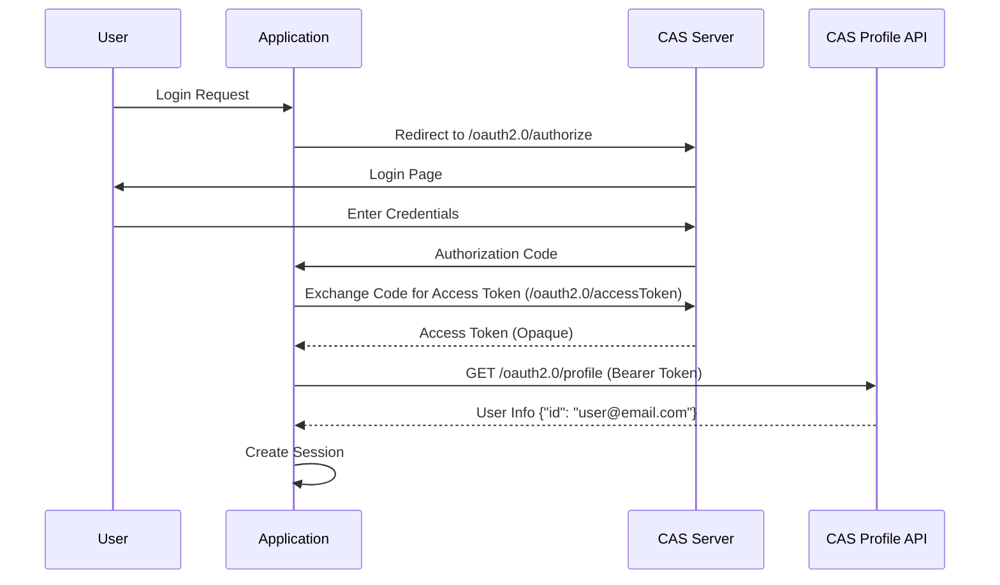
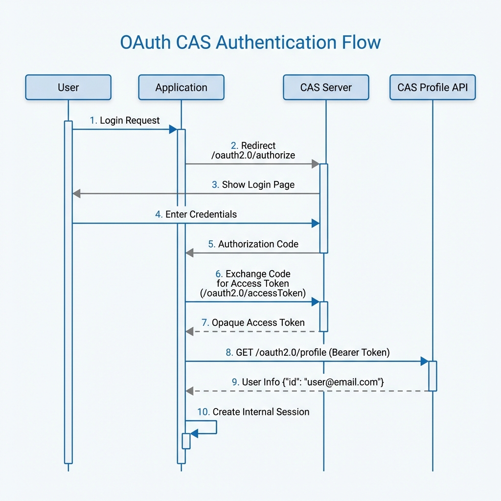
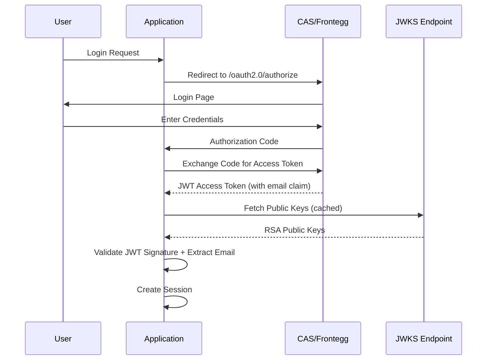
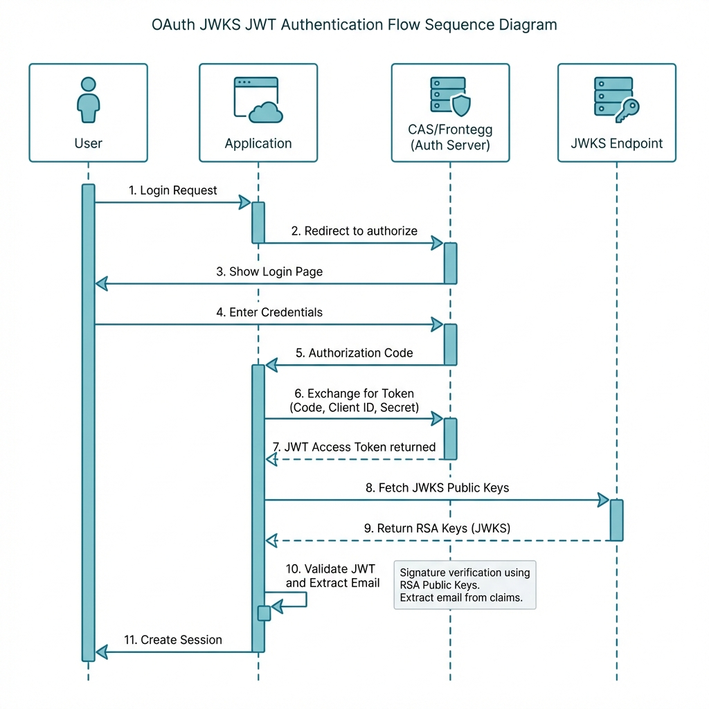

# OAuth Authentication Migration: CAS to Frontegg Compatibility

## Overview

This document explains the OAuth authentication changes made to the `kp-identity-lib` project to enable future migration from **CAS (Central Authentication Service)** to **Frontegg** with minimal configuration changes.

---

## The Problem

### Old CAS OAuth Flow (Before Changes)





**Key Characteristics:**
- Access token was **opaque** (not a JWT)
- Required an **additional API call** to `/oauth2.0/profile` to get user email
- User email was in the `id` field of profile response
- **Frontegg does NOT support this flow** - it returns a proper JWT directly

### Old Code (OAuthController.java)

```java
// OLD APPROACH - Called CAS Profile API to get user email
private OAuthUserInfoResp getUserEmailIdFromCAS(OAuthTokens tokens) {
    HttpHeaders headers = new HttpHeaders();
    headers.add("Authorization", "Bearer " + tokens.accessToken);
    HttpEntity<?> request = new HttpEntity<>(body, headers);
    
    // Extra HTTP call to get user info
    ResponseEntity<OAuthUserInfoResp> casResp =
            new RestTemplate().postForEntity(getCASUserInfoUri(), request, OAuthUserInfoResp.class);
    return casResp.getBody();
}

// Old DTO - email was in "id" field
static class OAuthUserInfoResp {
    @JsonProperty("id")  // CAS specific field name
    private String userEmailId;
}
```

---

## The Solution

### New JWKS-Based JWT Flow (After Changes)





**Key Improvements:**
- Access token is now a **proper JWT** containing claims
- **No extra API call** needed - email is extracted directly from JWT
- JWT signature validated using **JWKS (JSON Web Key Set)**
- **Works with both CAS and Frontegg** - just change configuration

---

## Files Changed

### 1. New Configuration: JwtDecoderConfig.java

```java
@Configuration
public class JwtDecoderConfig {

    @Value("${spring.security.oauth2.client.registration.idc.jwt.jwks-url}")
    private String jwksUrl;  // Configurable JWKS endpoint

    @Bean
    public JwtDecoder jwtDecoder() {
        return NimbusJwtDecoder.withJwkSetUri(jwksUrl)
                .jwsAlgorithms(algorithms -> algorithms.add(SignatureAlgorithm.RS512))
                .build();
    }
}
```

> **IMPORTANT:** The JWKS URL is configurable. To switch to Frontegg, just change this property:
> - **CAS**: `https://cas.example.com/.well-known/jwks.json`
> - **Frontegg**: `https://your-tenant.frontegg.com/.well-known/jwks.json`

---

### 2. New Service: JwtValidatorService.java

```java
@Service
@RequiredArgsConstructor
public class JwtValidatorService {

    private final JwtDecoder jwtDecoder;  // Injected Spring Bean

    public <T> T validateJwtAndDeserialize(String token, Class<T> cls) {
        try {
            // 1. Decode and validate JWT using JWKS
            Jwt jwt = jwtDecoder.decode(token);
            
            // 2. Extract only email claim
            Map<String, Object> filteredClaims = new HashMap<>(jwt.getClaims());
            filteredClaims.keySet().removeIf(k -> !k.equals("email"));
            
            // 3. Deserialize to DTO
            return SerializationUtils.convertTo(filteredClaims, cls);
            
        } catch (JwtException jwtEx) {
            throw new ResponseStatusException(HttpStatus.UNAUTHORIZED, 
                "Invalid JWT signature or structure", jwtEx);
        }
    }
}
```

---

### 3. Modified Controller: OAuthController.java

```diff
 // Dependency injection
 private final AccountsUserInfoDBService accountsUserInfoDBService;
+private final JwtValidatorService jwtValidatorService;

 // In oauthCallback method:
 val userOAuthTokens = validateAuthorisedCode(oAuthStateReq.getOauthCode());
-val oAuthUserInfoResp = getUserEmailIdFromCAS(userOAuthTokens);

+try {
+    oAuthUserInfoResp = jwtValidatorService.validateJwtAndDeserialize(
+            userOAuthTokens.getAccessToken(),
+            OAuthUserInfoResp.class
+    );
+    if (oAuthUserInfoResp == null || oAuthUserInfoResp.getUserEmailId() == null) {
+        throw new ResponseStatusException(HttpStatus.UNAUTHORIZED, "Unauthorized access");
+    }
+} catch (Exception ex) {
+    log.error("JWT verification failed", ex);
+    return getProfileErrorViewDeferredObject("JWT verification failed", null, false);
+}

 // DTO change - email field name
 static class OAuthUserInfoResp {
-    @JsonProperty("id")
+    @JsonProperty("email")
     private String userEmailId;
+    
+    @JsonIgnoreProperties(ignoreUnknown = true)  // Ignore extra claims
 }
```

---

### 4. Dependency Added: build.gradle

```diff
+implementation 'org.springframework.security:spring-security-oauth2-jose'
```

This provides `NimbusJwtDecoder` for JWKS-based JWT validation.

---

## Configuration Required for Migration

| Property | CAS Value | Frontegg Value |
|----------|-----------|----------------|
| `spring.security.oauth2.client.registration.idc.jwt.jwks-url` | `https://cas.idc.com/.well-known/jwks.json` | `https://your-app.frontegg.com/.well-known/jwks.json` |
| `spring.security.oauth2.client.provider.idc.authorization-uri` | `${cas.server.location}/oauth2.0/authorize` | `https://your-app.frontegg.com/oauth/authorize` |
| `spring.security.oauth2.client.provider.idc.token-uri` | `${cas.server.location}/oauth2.0/accessToken` | `https://your-app.frontegg.com/oauth/token` |

> **TIP:** The migration to Frontegg is now just a **configuration change** in application.yml - no code changes needed!

---

## Interview Questions & Answers

### Q1: What problem were you solving?

**Answer:** Our application used CAS OAuth which had a two-step flow: first get an opaque access token, then call a profile API to get user details. Frontegg (our target migration platform) returns a proper JWT with claims directly. I refactored the authentication to use JWKS-based JWT validation, which works with both CAS (after they enabled JWT support) and Frontegg.

### Q2: What is JWKS and why did you use it?

**Answer:** JWKS (JSON Web Key Set) is a standard endpoint that exposes public keys for JWT signature verification. Instead of hardcoding keys, the application fetches them dynamically from the JWKS URL. This provides:
- **Key rotation support** - provider can rotate keys without app changes
- **Provider agnostic** - same code works with any OAuth provider
- **Security** - signature verification prevents token tampering

### Q3: How does NimbusJwtDecoder work?

**Answer:** `NimbusJwtDecoder` is Spring Security's JWT decoder that:
1. Fetches public keys from the JWKS endpoint (with caching)
2. Parses the JWT header to find the `kid` (key ID)
3. Matches the `kid` with keys from JWKS
4. Validates the signature using the RSA public key
5. Checks standard claims (expiry, issuer, etc.)
6. Returns the decoded JWT with claims

### Q4: What was the key difference in the DTO?

**Answer:** 
- **Old CAS format**: User email was in the `id` field of profile API response
- **New JWT format**: User email is in the standard `email` claim

I changed `@JsonProperty("id")` to `@JsonProperty("email")` and added `@JsonIgnoreProperties(ignoreUnknown = true)` to handle varying claims between providers.

### Q5: How did you ensure backward compatibility?

**Answer:** CAS was configured to return proper JWTs instead of opaque tokens. The old `getUserEmailIdFromCAS()` method still exists but is no longer called. If needed, we could add a feature flag to switch between flows.

### Q6: What algorithm did you use for signature verification?

**Answer:** RS512 (RSA with SHA-512). This is configured in `JwtDecoderConfig`:
```java
.jwsAlgorithms(algorithms -> algorithms.add(SignatureAlgorithm.RS512))
```

### Q7: How does this make Frontegg migration easier?

**Answer:** The entire authentication flow is now configuration-driven. To migrate:
1. Change `jwks-url` to Frontegg's JWKS endpoint
2. Update authorization/token URIs
3. No code changes required

---

## Commits

| Commit | Description |
|--------|-------------|
| `ee9532d` | Initial attempt with manual JWT parsing in `JwtTokenUtils` |
| `cbed023` | Refactored to use Spring's `NimbusJwtDecoder` with `JwtDecoderConfig` |
| `42c2b88` | Cleaned up code, removed debug logs |
| `b52956d` | Final squashed commit merged to main branch |
