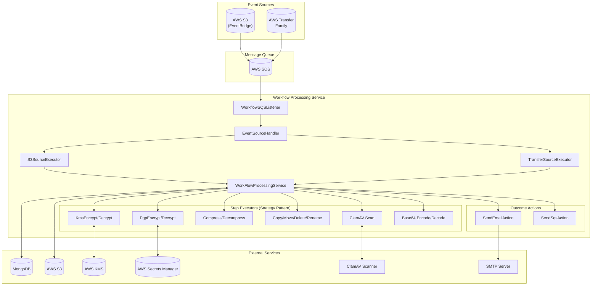
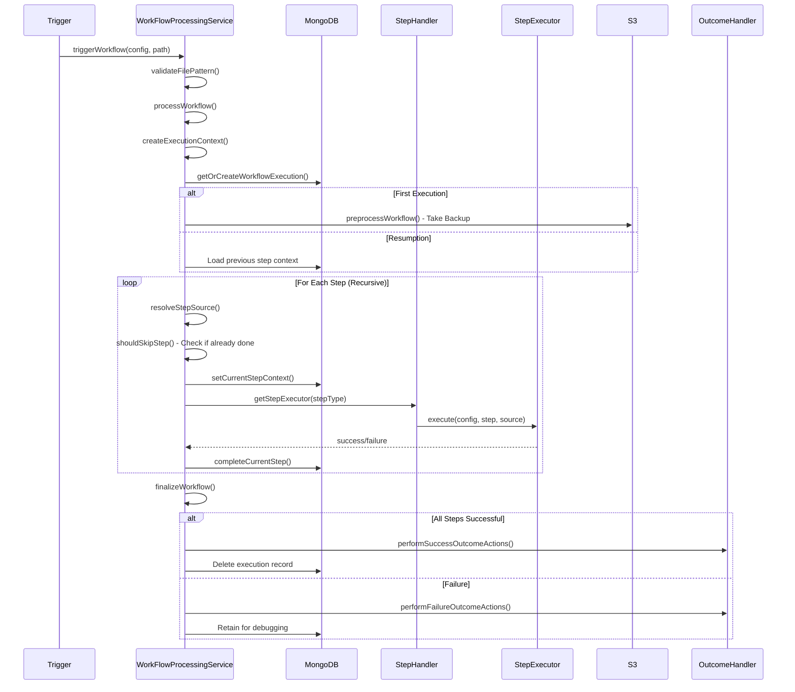
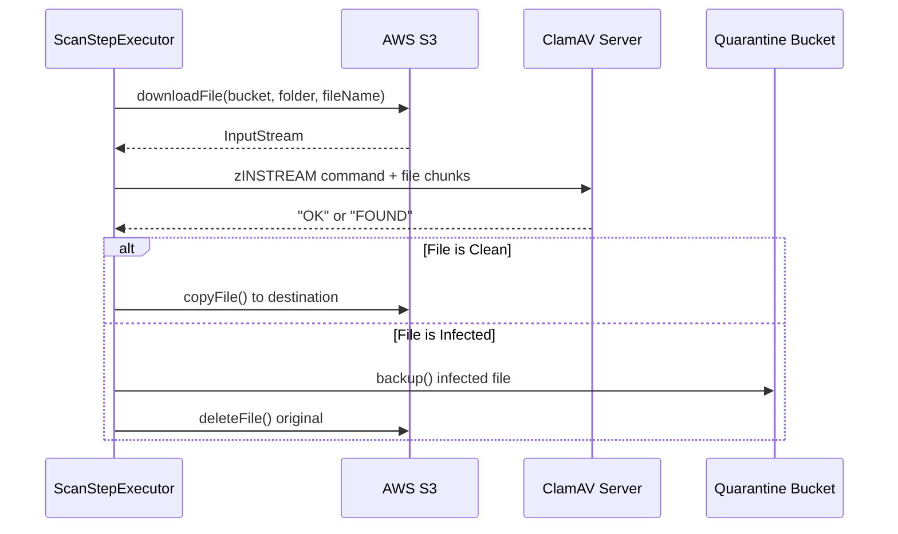
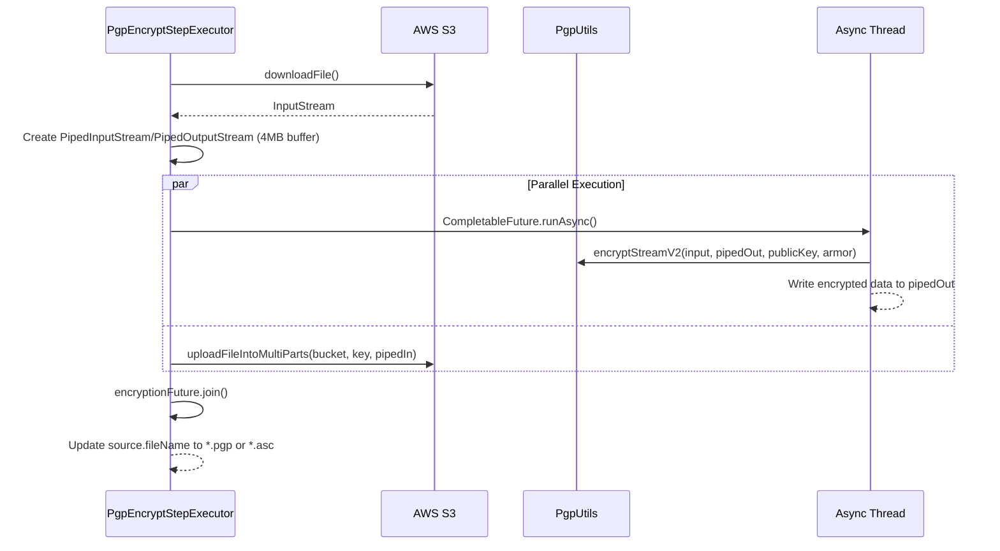
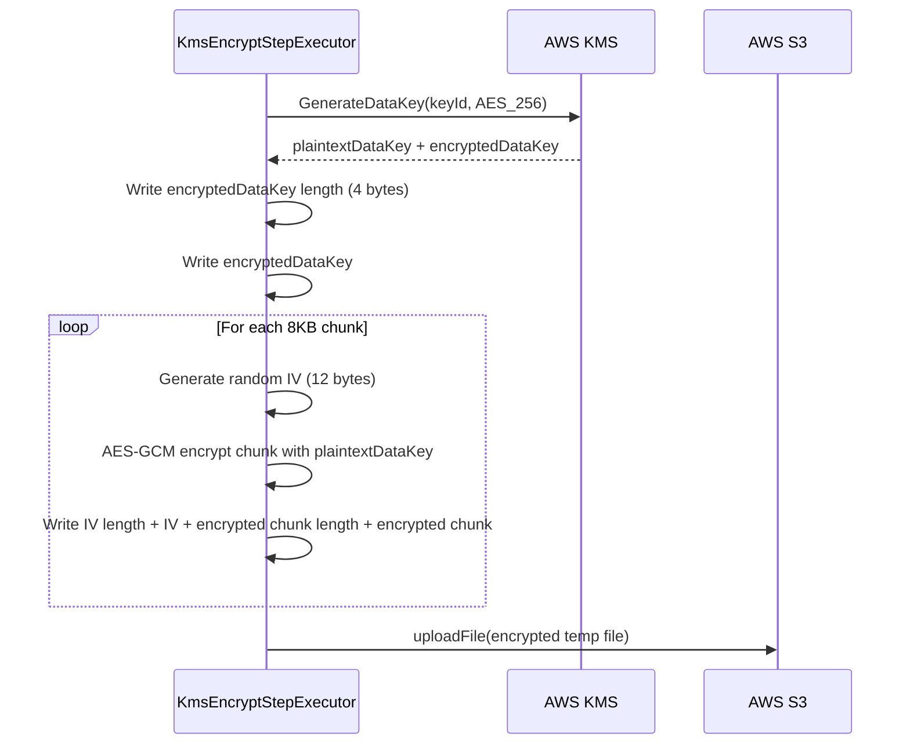

# Workflow Processing Service - Interview Walkthrough

## Overview

The **workflow-processing-service** is an event-driven microservice that processes file workflows triggered by S3 events. It executes configurable transformation pipelines (encryption, compression, virus scanning, file operations) on files and handles success/failure notifications.

---

## High-Level Architecture



---

## Core Components

### 1. Message Entry Point - `WorkflowSQSListener`

```java
@SqsListener(
    value = "${aws.sqs.queue.name}",
    maxConcurrentMessages = "${aws.sqs.queue.max-concurrent-messages}",
    maxMessagesPerPoll = "${aws.sqs.queue.max-messages-per-poll}",
    messageVisibilitySeconds = "${aws.sqs.queue.message-visibility-seconds}")
public void handleMessages(String message) {
    String traceId = UUIDUtils.generateTraceId();
    MDC.put("traceId", traceId);  // Distributed tracing
    
    JsonNode rootNode = ObjectMapperUtils.deserializeJson(message);
    String source = rootNode.path("source").asText();
    
    var eventSourceExecutor = eventSourceHandler.getEventSourceExecutor(source);
    eventSourceExecutor.execute(message);
}
```

**Key Points:**
- Uses Spring Cloud AWS SQS integration
- Configurable concurrency via properties
- Implements distributed tracing with MDC
- Routes to appropriate executor based on event source

---

### 2. Event Source Routing - `EventSourceHandler`

```java
@Component
public class EventSourceHandler {
    private final Map<String, IEventSourceExecutor> eventSourceExecutorMap;
    
    public IEventSourceExecutor getEventSourceExecutor(String eventSourceType) {
        return eventSourceExecutorMap.get(eventSourceType);
    }
}
```

**Design Pattern:** **Strategy Pattern** with Spring's automatic bean collection
- Implementations are registered as Spring beans with component names (`@Component("aws.s3")`)
- Spring automatically injects all `IEventSourceExecutor` beans into the map

---

### 3. S3 Event Processing - `S3SourceExecutor`

```java
@Component("aws.s3")
public class S3SourceExecutor implements IEventSourceExecutor {
    public void execute(String messageBody) {
        S3SqsMessage s3SqsMessage = ObjectMapperUtils.deserialize(messageBody, S3SqsMessage.class);
        
        // 🛡️ Infinite Loop Prevention
        if (isObjectGeneratedByTiqWps(bucketName, key)) {
            log.info("Object was generated by tiq-wps. Skipping to avoid infinite loop.");
            return;
        }
        
        // Fetch matching workflows from MongoDB
        List<WorkflowConfig> workflows = workFlowProcessingService.getWorkflows(...);
        
        // Trigger each matching workflow
        for (WorkflowConfig workflow : workflows) {
            workFlowProcessingService.triggerWorkflow(workflow, parsedPath);
        }
    }
}
```

**Key Feature - Infinite Loop Prevention:**
```java
private boolean isObjectGeneratedByTiqWps(String bucketName, String key) {
    HeadObjectResponse response = s3ObjClient.getS3Client().headObject(headObjectRequest);
    return "tiq-wps".equals(response.metadata().get("generated-by"));
}
```
Files created by the service have metadata `generated-by: tiq-wps` to prevent re-processing.

---

### 4. Workflow Orchestration - `WorkFlowProcessingService`

This is the **core orchestrator** with 750+ lines handling the complete workflow lifecycle:



#### Key Methods:

| Method | Purpose |
|--------|---------|
| `triggerWorkflow()` | Validates file pattern before processing |
| `processWorkflow()` | Main entry point - creates context, handles preprocessing |
| `executeStepsRecursively()` | Recursive step execution with resumption support |
| `executeSingleStep()` | Executes individual step with error handling |
| `resolveStepSource()` | Determines input source (previous step output vs original file) |
| `finalizeWorkflow()` | Handles success/failure outcomes |

---

### 5. Step Execution - Strategy Pattern

#### Interface:
```java
public interface IStepExecutor {
    Boolean execute(WorkflowConfig workflowConfig, StepContext step, SourceModelInternal source);
}
```

#### Handler:
```java
@Component
public class StepExecutorHandler {
    private final Map<String, IStepExecutor> stepExecutorMap;
    
    public IStepExecutor getStepExecutor(String stepType) {
        return stepExecutorMap.get(stepType);
    }
}
```

#### Available Step Executors (15+ Implementations):

| Step Type | Implementation | Description |
|-----------|---------------|-------------|
| `pgpEncrypt` | PgpEncryptStepExecutor | Encrypt files using PGP public key |
| `pgpDecrypt` | PgpDecryptStepExecutor | Decrypt PGP encrypted files |
| `kmsEncrypt` | KmsEncryptStepExecutor | AWS KMS envelope encryption |
| `kmsDecrypt` | KmsDecryptStepExecutor | AWS KMS decryption |
| `compress` | CompressStepExecutor | GZIP/ZIP/ZSTD/TAR compression |
| `decompress` | DecompressStepExecutor | Decompress archives |
| `scan` | ScanStepExecutor | ClamAV virus scanning |
| `copy` | CopyStepExecutor | S3-to-S3 file copy |
| `move` | MoveStepExecutor | S3 file move (copy + delete) |
| `delete` | DeleteStepExecutor | Delete source file |
| `rename` | RenameStepExecutor | Rename file with pattern |
| `encode` | EncodeStepExecutor | Base64 encoding |
| `decode` | DecodeStepExecutor | Base64 decoding |
| `tag` | TagStepExecutor | Add S3 object tags |

---

### 6. Outcome Actions

```java
@Component
public class OutcomeActionsHandler {
    private final Map<String, IOutcomeActionExecutor> executorMap;
}
```

| Action | Implementation | Purpose |
|--------|---------------|---------|
| `sendEmail` | SendEmailActionExecutor | Send success/failure emails via SMTP |
| `sendSqs` | SendSqsActionExecutor | Push message to another SQS queue |

**Email Templates:** Stored in MongoDB, rendered with Mustache templating.

---

## Key Design Decisions

### 1. Workflow Resumption

```java
WorkflowExecutionModel workflowExecution = 
    workflowExecutionServiceInternal.getOrCreateWorkflowExecution(workflowConfig, path, startTime);

if (StepContextManager.shouldSkipStep(executionId, step, ...)) {
    log.info("Step {} already completed, skipping execution", stepType);
    return true;
}
```

**Why?** Failed workflows can resume from the last successful step, avoiding re-processing of expensive operations like encryption.

### 2. File Backup Before Processing

```java
private void preprocessWorkflow(WorkflowConfig workflowConfig, String fileName) {
    var backup = workflowsPreprocessingService.takeBackup(
        source, workflowConfig.getMetadata().getHistoryFolderPath());
}
```

**Why?** Enables rollback if workflow fails midway.

### 3. Continue on Failure Flag

```java
boolean continueOnFailure = step.getContinueOnFailure() != null ? step.getContinueOnFailure() : false;
if (!continueOnFailure) {
    return false; // Stop execution
}
```

**Why?** Allows non-critical steps to fail without stopping the entire workflow.

### 4. Source Resolution Chain

```java
if (step.getSource().equals(StepSource.PREVIOUS_STEP)) {
    sourceModelInternal.setBucketName(previousStep.getDestination().getBucketName());
    sourceModelInternal.setFolderPath(previousStep.getDestination().getFolderPath());
} else if (step.getSource().equals(StepSource.ORIGINAL)) {
    sourceModelInternal.setBucketName(workflowConfig.getSource().getTiqBucketName());
}
```

**Why?** Steps can operate on either the original file or the output of the previous step.

---

## AWS Service Integrations

| Service | Usage |
|---------|-------|
| **S3** | File storage, source/destination buckets, multipart uploads |
| **SQS** | Event ingestion, async notifications |
| **KMS** | Envelope encryption/decryption |
| **Secrets Manager** | PGP keys, connection credentials |
| **EventBridge** | S3 event notifications |

---

## Data Models

### WorkflowExecutionContext
```java
@Data @Builder
public class WorkflowExecutionContext {
    private String workflowId;
    private String latestFileName;
    private String latestFilePath;
    private String latestBucketName;
    private boolean allStepsSuccessful = true;
    private List<String> errorMessages;
    private int completedSteps;
    private int totalSteps;
    private Integer currentStepIndex;  // For resumption
}
```

---

## Interview Questions & Answers

### Architecture & Design

#### Q1: How does the service handle high concurrency?

**Answer:**
```yaml
aws.sqs.queue:
  max-concurrent-messages: 10
  max-messages-per-poll: 10
  message-visibility-seconds: 1200
```
- Spring Cloud AWS SQS manages concurrency via thread pool
- Visibility timeout prevents duplicate processing
- Each message is processed independently

---

#### Q2: Why use the Strategy Pattern for step executors?

**Answer:**
- **Open/Closed Principle**: Add new step types without modifying existing code
- **Single Responsibility**: Each executor handles one transformation
- **Testability**: Mock individual executors in unit tests
- **Spring Integration**: Auto-wiring via `@Component("stepType")` naming

---

#### Q3: How do you prevent infinite loops when workflows create new S3 objects?

**Answer:**
Files created by the service include S3 metadata:
```java
metadata.put("generated-by", "tiq-wps");
```
Before processing, we check:
```java
if ("tiq-wps".equals(response.metadata().get("generated-by"))) {
    return; // Skip processing
}
```

---

#### Q4: How does workflow resumption work?

**Answer:**
1. `WorkflowExecutionModel` persisted in MongoDB with `currentStepIndex`
2. On re-trigger, `getOrCreateWorkflowExecution()` finds existing record
3. `shouldSkipStep()` checks if step output already exists in S3
4. Skipped steps restore context from `previousStepContext`

---

### Error Handling

#### Q5: What happens when a step fails?

**Answer:**
```java
try {
    boolean stepResult = stepExecutor.execute(...);
    if (!stepResult) {
        context.setAllStepsSuccessful(false);
        if (!continueOnFailure) return false;
    }
} catch (Exception e) {
    handleStepException(e, step, ...);
    if (!continueOnFailure) return false;
}
```
- Errors collected in `errorMessages` list
- `continueOnFailure` flag controls workflow termination
- Failure actions (email/SQS) triggered for notifications

---

#### Q6: How do you ensure exactly-once processing?

**Answer:**
- SQS visibility timeout (1200s) prevents re-delivery during processing
- Workflow execution record prevents duplicate workflow triggers
- TODO in code: Store message ID for idempotency
- S3 metadata check prevents re-processing of generated files

---

### System Design

#### Q7: How would you scale this service?

**Answer:**
1. **Horizontal Scaling**: Stateless service, deploy multiple instances
2. **SQS Auto-scaling**: AWS handles queue scaling automatically
3. **MongoDB Sharding**: Shard by `workflowId` for execution records
4. **Step Parallelization**: Independent steps could run concurrently (future enhancement)
5. **Memory Optimization**: Stream processing avoids loading full files

---

#### Q8: Trade-offs of event-driven vs synchronous design?

**Answer:**
| Aspect | Event-Driven (Current) | Synchronous |
|--------|------------------------|-------------|
| Latency | Higher (queue overhead) | Lower |
| Scalability | Better (decoupled) | Limited |
| Fault Tolerance | Better (retry, DLQ) | Requires custom handling |
| Complexity | Higher | Lower |
| Observability | Harder (distributed) | Easier |

---

### Coding & Implementation

#### Q9: Why use piped streams in PGP encryption?

**Answer:**
```java
PipedInputStream pipedIn = new PipedInputStream(4 * 1024 * 1024);
PipedOutputStream pipedOut = new PipedOutputStream(pipedIn);

CompletableFuture<Void> encryptionFuture = CompletableFuture.runAsync(() -> {
    PgpUtils.encryptStreamV2(s3InputStream, pipedOut, publicKey, armor, fileName);
});

s3Service.uploadFileIntoMultiParts(destBucket, fullDestKey, pipedIn);
```
- **Memory Efficiency**: Avoids loading entire file into memory
- **Concurrent Processing**: Encryption and upload happen in parallel
- **Backpressure**: PipedStream buffer (4MB) handles speed mismatch

---

#### Q10: How do you handle distributed tracing?

**Answer:**
```java
String traceId = UUIDUtils.generateTraceId();
MDC.put("traceId", traceId);  // SLF4J Mapped Diagnostic Context
// ... all logs include traceId
MDC.remove("traceId");
```
- Unique trace ID per message
- Propagated across async operations
- Enables log correlation across components

---

### Follow-up Questions You Should Prepare For

1. **How would you implement dead-letter queue handling?**
2. **How do you monitor this service in production?**
3. **What metrics would you track?**
4. **How would you handle very large files (>5GB)?**
5. **How do you test this service?**
6. **What database indexes would you create for workflow queries?**
7. **How would you implement rate limiting?**

---

## Deep Dive: Step Executor Implementations

### 1. ClamAV Virus Scanning Integration

#### Architecture


#### ClamAV Scanner Implementation

```java
@Service
public class ClamAVScanner {
    @Value("${clamav.host}") private String host;
    @Value("${clamav.port}") private Integer port;
    @Value("${clamav.timeout}") private Integer timeout;  // 600 seconds for large files

    public boolean scan(InputStream inputStream) throws IOException {
        try (Socket socket = new Socket(host, port)) {
            socket.setSoTimeout(timeout);
            OutputStream out = socket.getOutputStream();
            
            // 1. Send zINSTREAM command (ClamAV streaming protocol)
            out.write("zINSTREAM\0".getBytes(StandardCharsets.US_ASCII));
            
            // 2. Stream file in 8KB chunks with 4-byte size prefix
            byte[] buffer = new byte[8192];
            int bytesRead;
            while ((bytesRead = inputStream.read(buffer)) > 0) {
                byte[] sizeBytes = ByteBuffer.allocate(4).putInt(bytesRead).array();
                out.write(sizeBytes);         // Chunk size (4 bytes, big-endian)
                out.write(buffer, 0, bytesRead);
                out.flush();
            }
            
            // 3. Send end-of-stream marker (zero-length chunk)
            out.write(ByteBuffer.allocate(4).putInt(0).array());
            
            // 4. Read response
            String response = new BufferedReader(new InputStreamReader(in)).readLine();
            
            return response.contains("OK");  // "OK" = clean, "FOUND" = infected
        }
    }
}
```

#### Scan Step Executor

```java
@Component("scan")
public class ScanStepExecutor implements IStepExecutor {
    
    public Boolean execute(WorkflowConfig config, StepContext step, SourceModelInternal source) {
        try (InputStream s3InputStream = s3Service.downloadFile(bucket, folder, fileName)) {
            boolean isClean = clamAVScanner.scan(s3InputStream);
            
            if (isClean) {
                return s3Service.copyFile(source, destBucket, destFolder, null);
            } else {
                // Quarantine infected file: copy to quarantine folder then delete original
                handleInfectedFile(source, quarantineFolderPath, workflowId);
                return false;
            }
        }
    }
    
    private void handleInfectedFile(...) {
        s3Service.backup(source, quarantineFolderPath);  // Copy to quarantine
        s3Service.deleteFile(source);                    // Delete original
    }
}
```

**Key Implementation Points:**
- **Socket-based protocol**: Direct TCP connection to ClamAV daemon
- **Streaming**: Files never fully loaded into memory
- **zINSTREAM protocol**: Each chunk prefixed with 4-byte length
- **Quarantine handling**: Infected files moved, not just blocked

---

### 2. PGP Encryption/Decryption

#### PGP Encryption Architecture


#### PGP Encryption Implementation

```java
@Component("pgpEncrypt")
public class PgpEncryptStepExecutor implements IStepExecutor {
    
    public Boolean execute(WorkflowConfig config, StepContext step, SourceModelInternal source) {
        String publicKeyUrl = step.getConfiguration().getPgpPublicKeyFileUrl();
        boolean armor = config.getArmor() != null ? config.getArmor() : false;
        
        // 1. Fetch public key from URL
        PGPPublicKey publicKey = PgpUtils.fetchPublicKeyFromUrl(publicKeyUrl);
        
        // 2. Download source file from S3
        try (InputStream s3InputStream = s3Service.downloadFile(bucket, folder, fileName)) {
            
            // 3. Create piped streams (4MB buffer for backpressure handling)
            PipedInputStream pipedIn = new PipedInputStream(4 * 1024 * 1024);
            PipedOutputStream pipedOut = new PipedOutputStream(pipedIn);
            
            String traceId = MDC.get("traceId");  // Preserve trace context
            
            // 4. Encrypt in background thread
            CompletableFuture<Void> encryptionFuture = CompletableFuture.runAsync(() -> {
                MDC.put("traceId", traceId);  // Propagate tracing
                try {
                    PgpUtils.encryptStreamV2(s3InputStream, pipedOut, publicKey, armor, fileName);
                } finally {
                    pipedOut.close();
                }
            });
            
            // 5. Upload encrypted stream to S3 (reads from pipedIn)
            String encryptedFileName = fileName + (armor ? ".asc" : ".pgp");
            s3Service.uploadFileIntoMultiParts(destBucket, destKey, pipedIn);
            
            encryptionFuture.join();  // Wait for encryption to complete
            source.setFileName(encryptedFileName);
            return true;
        }
    }
}
```

#### PGP Decryption Implementation

```java
@Component("pgpDecrypt")
public class PgpDecryptStepExecutor implements IStepExecutor {
    
    public Boolean execute(WorkflowConfig config, StepContext step, SourceModelInternal source) {
        String privateKeySecretName = step.getConfiguration().getPrivateKeySecretName();
        
        // 1. Retrieve private key from AWS Secrets Manager
        Map<String, String> secrets = secretsManagerService.getSecrets(privateKeySecretName);
        String privateKey = secrets.get("private_key");
        String passphrase = secrets.get("passphrase");
        
        // 2. Download encrypted file from S3
        try (InputStream encryptedInput = s3Service.downloadFile(bucket, folder, fileName)) {
            
            // 3. Decrypt using Bouncy Castle
            InputStream decryptedStream = PgpUtils.decryptStreamV2(encryptedInput, privateKey, passphrase);
            
            // 4. Upload decrypted file (remove .pgp/.gpg extension)
            String decryptedFileName = WorkflowsPreprocessingUtils.getDecryptedFileName(fileName);
            s3Service.uploadFileIntoMultiParts(destBucket, destKey, new BufferedInputStream(decryptedStream));
            
            source.setFileName(decryptedFileName);
            return true;
        }
    }
}
```


Final of PGP encryption and decryption flow in one go
```mermaid
        SENDER
        ======

        [Plain Data]
             |
             |  (A) Create HASH of data
             v
        [Data Hash]
             |
             |  Encrypt hash with SENDER PRIVATE KEY
             v
        [Digital Signature]
        
        
        [Plain Data]
             |
             |  (B) Generate random AES key
             |
             v
        [AES Encrypt Data]
             |
             v
        [Encrypted Data]
        
        
        [AES Key]
             |
             |  Encrypt AES key with RECEIVER PUBLIC KEY
             v
        [Encrypted AES Key]


---------------- SEND OVER NETWORK ----------------

        [Encrypted Data]
        [Encrypted AES Key]
        [Digital Signature]
        
        
        RECEIVER
        ========

        [Encrypted AES Key]
             |
             |  Decrypt with RECEIVER PRIVATE KEY
             v
        [AES Key]
        
        
        [Encrypted Data]
             |
             |  Decrypt with AES Key
             v
        [Plain Data]
        
        
        [Digital Signature]
             |
             |  Decrypt with SENDER PUBLIC KEY
             v
        [Hash from Sender]
        
        
        [Plain Data]
             |
             |  Create HASH again
             v
        [Hash from Receiver]
        
        
        COMPARE:
        Hash from Sender == Hash from Receiver
             |
             v
        ✔ VALID MESSAGE
```

**Key Implementation Points:**
- **BouncyCastle library**: `bcprov-jdk18on`, `bcpg-jdk18on`, `bcpkix-jdk18on`
- **Piped streams**: Encryption and upload happen concurrently (producer-consumer pattern)
- **4MB buffer**: Handles speed mismatch between encryption and upload
- **Armor mode**: `.asc` (ASCII armored) vs `.pgp` (binary)
- **Secrets Manager integration**: Private keys stored securely

---

### 3. AWS KMS Envelope Encryption

#### KMS Architecture


#### KMS Encryption Service

```java
@Service
public class KMSEncryptionService {
    
    public void encryptFile(InputStream input, OutputStream output, String keyId, int bufferSize) {
        // 1. Generate Data Key from KMS (envelope encryption)
        GenerateDataKeyResponse keyResponse = kmsClient.kmsClient().generateDataKey(
            GenerateDataKeyRequest.builder()
                .keyId(keyId)
                .keySpec(DataKeySpec.AES_256)
                .build());
        
        byte[] plainKey = keyResponse.plaintext().asByteArray();      // Used for encryption
        byte[] encryptedKey = keyResponse.ciphertextBlob().asByteArray();  // Stored in file
        
        // 2. Write encrypted data key header
        output.write(ByteBuffer.allocate(4).putInt(encryptedKey.length).array());
        output.write(encryptedKey);
        
        // 3. Encrypt file in chunks using AES-256-GCM
        byte[] buffer = new byte[bufferSize];  // 8KB chunks
        int bytesRead;
        
        while ((bytesRead = input.read(buffer)) != -1) {
            byte[] chunk = Arrays.copyOf(buffer, bytesRead);
            
            // Generate unique IV for each chunk
            byte[] iv = new byte[12];
            new SecureRandom().nextBytes(iv);
            
            // AES-GCM encryption
            Cipher cipher = Cipher.getInstance("AES/GCM/NoPadding");
            cipher.init(Cipher.ENCRYPT_MODE, 
                new SecretKeySpec(plainKey, "AES"), 
                new GCMParameterSpec(128, iv));
            byte[] encryptedChunk = cipher.doFinal(chunk);
            
            // Write: [IV length][IV][encrypted chunk length][encrypted chunk]
            output.write(ByteBuffer.allocate(4).putInt(iv.length).array());
            output.write(iv);
            output.write(ByteBuffer.allocate(4).putInt(encryptedChunk.length).array());
            output.write(encryptedChunk);
        }
    }
}
```

#### File Format Structure
```
┌─────────────────────────────────────────────────────────────┐
│ Encrypted Data Key Length (4 bytes, big-endian)             │
├─────────────────────────────────────────────────────────────┤
│ Encrypted Data Key (variable length)                        │
├─────────────────────────────────────────────────────────────┤
│ For each chunk:                                             │
│   ├── IV Length (4 bytes)                                   │
│   ├── IV (12 bytes)                                         │
│   ├── Encrypted Chunk Length (4 bytes)                      │
│   └── Encrypted Chunk (variable, includes GCM auth tag)     │
└─────────────────────────────────────────────────────────────┘
```

**Key Implementation Points:**
- **Envelope Encryption**: Data key encrypted with KMS, actual data encrypted with data key
- **AES-256-GCM**: Provides both confidentiality and integrity
- **Per-chunk IV**: Each 8KB chunk gets unique 12-byte IV
- **Temp file approach**: Currently uses temp file (TODO: streaming)

---

### 4. Compression Step

#### Supported Compression Types

| Type | Implementation | Extension | Use Case |
|------|---------------|-----------|----------|
| `gzip` | GzipCompression | `.gz` | Single file compression |
| `zip` | ZipCompression | `.zip` | Archive with directory structure |
| `zstd` | ZstdCompression | `.zst` | High-performance compression |
| `tar` | TarArchive | `.tar` | Archive without compression |

#### Compression Implementation

```java
@Component("compress")
public class CompressStepExecutor implements IStepExecutor {
    
    public Boolean execute(WorkflowConfig config, StepContext step, SourceModelInternal source) {
        String compressionType = step.getConfiguration().getCompressionType().getValue();
        CompressionLevel level = step.getConfiguration().getLevel();
        
        // 1. Download source file
        InputStream inputStream = s3Service.downloadFile(bucket, folder, fileName);
        
        // 2. Get appropriate compression handler (Strategy pattern)
        var fileCompressionExecutor = fileCompressionHandler.getFileCompressionExecutor(compressionType);
        
        // 3. Compress with streaming
        Long contentLength = s3Service.getContentLength(bucket, sourceKey);
        InputStream compressedStream = fileCompressionExecutor.compress(
            inputStream, fileName, level, contentLength);
        
        // 4. Upload compressed file
        String extension = compressionImplToExtension.get(compressionType);
        String compressedFileName = fileName + extension;  // e.g., file.txt.gz
        
        s3Service.uploadFileIntoMultiParts(destBucket, destKey, compressedStream);
        source.setFileName(compressedFileName);
        return true;
    }
}
```

---

### 5. S3 File Operations

#### Copy Step
```java
@Component("copy")
public class CopyStepExecutor implements IStepExecutor {
    public Boolean execute(...) {
        // Server-side copy (no data transfer through service)
        return s3Service.copyFile(source, destBucket, destFolder, null);
    }
}
```

#### Move Step (Copy + Delete)
```java
@Component("move")
public class MoveStepExecutor implements IStepExecutor {
    public Boolean execute(...) {
        // 1. Copy to destination
        Boolean isCopySuccess = s3Service.copyFile(source, destBucket, destFolder, null);
        
        if (isCopySuccess) {
            // 2. Delete from source
            // TODO: Implement rollback if delete fails
            return s3Service.deleteFile(source);
        }
        return false;
    }
}
```

#### Delete Step
```java
@Component("delete")
public class DeleteStepExecutor implements IStepExecutor {
    public Boolean execute(...) {
        return s3Service.deleteFile(sourceModelInternal);
    }
}
```

**Key Points:**
- **Server-side copy**: S3 CopyObject API, no data through service
- **Move = Copy + Delete**: Two-phase operation
- **No destination**: Delete step has no destination (sets null values for next step)

---

## Additional Interview Questions

### ClamAV Integration

#### Q11: Why use socket-based communication instead of HTTP for ClamAV?

**Answer:**
- ClamAV daemon uses a custom binary protocol (`clamd`)
- `zINSTREAM` command allows streaming without temp files
- Lower overhead than HTTP for large files
- Each chunk is prefixed with 4-byte length (big-endian)
- Zero-length chunk signals end of stream

#### Q12: How do you handle infected files?

**Answer:**
```java
private void handleInfectedFile(source, quarantinePath, workflowId) {
    s3Service.backup(source, quarantinePath);  // 1. Copy to quarantine
    s3Service.deleteFile(source);               // 2. Delete original
}
```
- Quarantine folder is configurable per workflow
- Original file is deleted after successful quarantine
- Workflow returns false → triggers failure outcome actions

---

### PGP Encryption

#### Q13: Why use PipedInputStream/PipedOutputStream?

**Answer:**
```java
PipedInputStream pipedIn = new PipedInputStream(4 * 1024 * 1024);
PipedOutputStream pipedOut = new PipedOutputStream(pipedIn);
```
- **Memory efficiency**: No need to buffer entire encrypted file
- **Concurrent processing**: Encryption writes to pipedOut, S3 upload reads from pipedIn
- **Backpressure**: 4MB buffer handles speed differences
- Producer-consumer pattern without explicit queues

#### Q14: How do you handle trace context in async operations?

**Answer:**
```java
String traceId = MDC.get("traceId");  // Capture before async

CompletableFuture.runAsync(() -> {
    MDC.put("traceId", traceId);      // Restore in async thread
    // ... encryption logic
});
```
- MDC is thread-local, doesn't propagate automatically
- Must manually capture and restore for correlation

---

### KMS Encryption

#### Q15: What is envelope encryption and why use it?

**Answer:**
1. **Generate data key** from KMS (plaintext + encrypted version)
2. **Encrypt data** with plaintext data key locally
3. **Store** encrypted data key with the file
4. **Plaintext key** never leaves memory, discarded after use

**Benefits:**
- Large files encrypted locally (fast, no network overhead)
- Only data key travels to/from KMS
- KMS handles key rotation for master key

#### Q16: Why use AES-GCM with per-chunk IVs?

**Answer:**
- **Authenticated encryption**: GCM provides both confidentiality + integrity
- **Unique IV per chunk**: Required for GCM security (nonce reuse is catastrophic)
- **12-byte IV**: Recommended size for GCM
- **128-bit auth tag**: Included in encrypted chunk output

---

### Compression

#### Q17: How do you support multiple compression algorithms?

**Answer:**
Same Strategy pattern as step executors:
```java
var executor = fileCompressionHandler.getFileCompressionExecutor(compressionType);
InputStream compressedStream = executor.compress(input, fileName, level, contentLength);
```

| compressionType | Bean Name | Outputs |
|-----------------|-----------|---------|
| `gzip` | GzipCompression | `.gz` |
| `zip` | ZipCompression | `.zip` |
| `zstd` | ZstdCompression | `.zst` |
| `tar` | TarArchive | `.tar` |

---

### S3 Operations

#### Q18: What's the difference between S3 Copy and Download+Upload?

**Answer:**
| Approach | S3 Copy API | Download + Upload |
|----------|-------------|-------------------|
| Data path | S3 → S3 (server-side) | S3 → Service → S3 |
| Speed | Fast | Slower |
| Bandwidth | Zero service bandwidth | 2x file size |
| Use case | Same-region copies | Cross-region or with transformation |

Our `copyFile()` uses `CopyObjectRequest` for server-side copy.

#### Q19: What happens if Move step's delete phase fails?

**Answer:**
Current behavior (with TODO):
```java
if (isCopySuccess) {
    // TODO: rollback the copy operation if delete fails
    if (!s3Service.deleteFile(source)) {
        log.warn("Move partially completed - file copied but delete failed");
    }
}
```
- File exists in both locations
- Step returns false
- **Improvement needed**: Rollback by deleting copied file

---

## Summary Points for Interview

1. **Event-Driven Architecture**: SQS → Service → Step Execution → Outcomes
2. **Strategy Pattern**: Extensible step executors with Spring auto-wiring
3. **Fault Tolerance**: Resumption, backup, continue-on-failure
4. **AWS Integration**: S3, SQS, KMS, Secrets Manager, EventBridge
5. **Observability**: Distributed tracing via MDC
6. **Security**: PGP/KMS encryption, virus scanning
7. **Scalability**: Stateless, horizontally scalable
8. **ClamAV**: Socket-based streaming protocol, quarantine handling
9. **PGP**: BouncyCastle, piped streams for concurrent encrypt+upload
10. **KMS**: Envelope encryption with AES-256-GCM, per-chunk IVs
